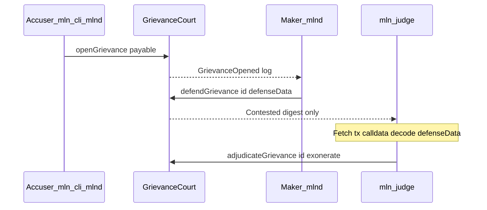

# Post-merge: bridge clients to secured GrievanceCourt

**Summary:** Deploy cooldown vs challenge guardrail; extract `mlnd/pkg/litvmevidence` + `mlnd/pkg/receiptstore`; `mln-cli grievance file`; `mlnd` accuser `resolveGrievance` watcher; `mln-judge`; Anvil helper script. On-chain judge timeout explicitly out of scope for v1.

## Context from the repo (at planning time; paths updated where layout changed)

- **Maker path:** [`mlnd/internal/litvm/watcher.go`](../../mlnd/internal/litvm/watcher.go) subscribes to `GrievanceOpened` where **accused == operator**, loads preimage from SQLite ([`mlnd/pkg/receiptstore/store.go`](../../mlnd/pkg/receiptstore/store.go)), validates, builds `defenseData`, and submits **`defendGrievance`** via [`mlnd/internal/litvm/defender.go`](../../mlnd/internal/litvm/defender.go). Embedded ABI is defend-only ([`mlnd/internal/litvm/court.go`](../../mlnd/internal/litvm/court.go) + `abi/grievancecourt_defend.json`).
- **Accuser path (was missing; now shipped):** [`mln-cli grievance file`](../../mln-cli/cmd/mln-cli/main.go); evidence/vault shared via [`mlnd/pkg/litvmevidence`](../../mlnd/pkg/litvmevidence) and [`mlnd/pkg/receiptstore`](../../mlnd/pkg/receiptstore). `mln-cli` imports `mlnd/pkg/*`, not `mlnd/internal/...`.
- **Taker vault:** Receipt NDJSON bridge: [`mlnd/internal/bridge/ndjson.go`](../../mlnd/internal/bridge/ndjson.go) (delegates to `receiptstore.ParseReceiptNDJSON`). Optional `swap_id` on vault rows; something must still populate the vault for `grievance file <swap_id>`.
- **Judge automation:** On-chain `Contested` only emits `keccak256(defenseData)` ([`contracts/src/GrievanceCourt.sol`](../../contracts/src/GrievanceCourt.sol)). The adjudicator loads `vLog.TxHash` → `eth_getTransactionByHash` → decode **`defendGrievance(bytes32,bytes)`** and unpack the v1 tuple ([`mlnd/pkg/litvmevidence/defense.go`](../../mlnd/pkg/litvmevidence/defense.go)).

---

## Fix 1 — Deploy guardrail (contracts)

**Goal:** Make it impossible to broadcast a known-bad pairing from [`contracts/script/Deploy.s.sol`](../../contracts/script/Deploy.s.sol): `cooldownPeriod` must be **strictly greater** than `challengeWindow` (minimum align with PHASE_15 “cooldown must exceed … challenge window”; registry has no visibility into `challengeWindow`, so the script is the right choke point).

**Implementation:**

- After reading `cooldownPeriod` and `challengeWindow`, add a Solidity `require(cooldownPeriod > challengeWindow, "cooldown<=challenge");` (or custom error) before `startBroadcast`.
- Optionally extend with `vm.envOr("DEPLOY_MIN_COOLDOWN_CHALLENGE_SLACK", uint256(0))` if you want an extra margin without encoding “epoch slack” numerically in-repo; otherwise document N hours in comments only.
- Add/adjust a small Foundry test that `forge script` / unit test expects revert when misconfigured (lightweight—assert revert path exists).

**Out of scope for v1 (per your call):** no new Solidity judge timeout / “default slash if judge idle.”

---

## Track 2 — Accuser UX and `mlnd` resolver (recommended first)

This track unblocks real users and E2E flows; the judge daemon is most useful once `openGrievance` + `defendGrievance` happen on the same deployment.

### 2a — Share evidence + vault code (`mln-cli` can import it)

**Promote or add packages under `mlnd/pkg/`** (mirroring `makerad`):

- **`mlnd/pkg/litvmevidence`:** `EvidencePreimage`, `ComputeEvidenceHash`, `ComputeGrievanceID`, defense tuple ABI pack/unpack (moved from former `mlnd/internal/litvm` evidence/defense code).
- **`mlnd/pkg/receiptstore`:** SQLite schema + `SaveReceipt` / `GetByEvidenceHash` / `GetBySwapID`, `ParseReceiptNDJSON`.

Refactor **`mlnd/internal/...`** to import these packages (behavior unchanged; tests updated import paths).

**Rationale:** avoids duplicating Appendix 13 bytes and keeps `mln-cli` / `mln-judge` aligned with [`contracts/src/EvidenceLib.sol`](../../contracts/src/EvidenceLib.sol).

### 2b — Taker-side persistence and `swap_id`

Pick one v1-stable approach (can combine):

- **A (minimal):** `mln-cli grievance file --receipt-json path` using the same NDJSON shape as bridge / [`mlnd/pkg/receiptstore/ndjson.go`](../../mlnd/pkg/receiptstore/ndjson.go) (no DB).
- **B (UX):** SQLite vault path env (e.g. `MLN_RECEIPT_VAULT_PATH`) + `swap_id` column so `grievance file <swap_id>` works. Requires **who writes the row**: hook in forger/sidecar failure path or a manual import.

Without **B**, `<swap_id>` is only meaningful after something populates it.

### 2c — `mln-cli grievance file`

- New command tree: `grievance file` (flags: accused address, epoch id optional if in receipt, bond value, dry-run).
- Load preimage (DB or JSON) → `ComputeEvidenceHash` → bind court with expanded ABI fragment: **`openGrievance(address,uint256,bytes32)` payable**.
- Env: [`mln-cli/internal/config`](../../mln-cli/internal/config) (`MLN_LITVM_HTTP_URL`, `MLN_GRIEVANCE_COURT_ADDR`, `MLN_ACCUSER_ETH_KEY` or `MLN_OPERATOR_ETH_KEY`).
- Tests: golden vectors in [`mlnd/pkg/litvmevidence`](../../mlnd/pkg/litvmevidence).

### 2d — `mlnd` accuser watcher → `resolveGrievance`

- New subscription: `GrievanceOpened` with **topic2 = accuser** ( `MLND_GRIEVANCE_RESOLVE_AUTO`, `MLND_ACCUSER_PRIVATE_KEY`, optional `MLND_ACCUSER_ADDR`, `MLND_ACCUSER_RESOLVE_DRY_RUN`).
- Track **grievanceId** (from log topic1); poll for **`deadline`** using **chain header time** ([`ParseGrievanceLog`](../../mlnd/internal/litvm/watcher.go)).
- When `block.timestamp >= deadline`, view read `grievances(id)` and confirm phase **Open** (`1`) before **`resolveGrievance`** ([`mlnd/internal/litvm/accuser_resolve.go`](../../mlnd/internal/litvm/accuser_resolve.go)).
- Opslog events for “resolve submitted” / revert reasons; never log full defense payloads.

**Permissionless note:** anyone can call `resolveGrievance`; automation is a **convenience** for the accuser.

---

## Track 1 — `mln-judge` daemon (parallel or immediately after Track 2)

**Layout:** [`mln-judge/go.mod`](../../mln-judge/go.mod) with `replace ../mlnd`.

**Flow:**

1. Subscribe/filter **`Contested(bytes32,address,bytes32)`** on court address.
2. For each log: fetch tx, decode `defendGrievance` calldata; assert `keccak256(defenseData)` matches log `defenseDataDigest`.
3. ABI-decode `defenseData` into the v1 tuple (mirror Solidity / `BuildDefenseData`).
4. **Verification policy (needs a crisp spec line):** today NDJSON `signature` / `nextHopPubkey` are opaque strings. Before “automatic uphold/exonerate,” define in [`PRODUCT_SPEC.md`](../../PRODUCT_SPEC.md) (defense correlators) the **exact signed message** and curve. Interim options:
   - **Strict:** implement message + curve per spec once written.
   - **Pragmatic v1:** service supports **`JUDGE_DRY_RUN`** + `cast` hint and **manual multisig runbook** ([`mln-judge/README.md`](../../mln-judge/README.md)).
5. Submit **`adjudicateGrievance(grievanceId, exonerateAccused)`** with judge key (`JUDGE_PRIVATE_KEY`); embed ABI fragment for judge + defend decode.

**Ops:** document key custody, RPC URL, confirmation depth, and pager on stuck `Contested` (liveness failure).

---

## Testing / CI

- **Go:** `go test ./...` in `mlnd`, `mln-cli`, `mln-judge`.
- **Integration (local Anvil):** [`scripts/test-grievance-local.sh`](../../scripts/test-grievance-local.sh); [`scripts/grievance-e2e-anvil.sh`](../../scripts/grievance-e2e-anvil.sh) for time-warp + `resolveGrievance`.

---

## Recommended sequencing

| Step | What |
|------|------|
| 0 | Deploy.s.sol `cooldownPeriod > challengeWindow` guardrail + test |
| 1 | Extract `mlnd/pkg/*` evidence + vault; refactor mlnd imports |
| 2 | `mln-cli grievance file` + receipt JSON (then swap_id if wired) |
| 3 | `mlnd` accuser resolve watcher + expanded court ABI |
| 4 | `mln-judge` with tx replay + verification policy + runbook |

Track 2 first maximizes user-facing value; Track 1 can start once `defendGrievance` tx shape is stable (it already is in mlnd).
