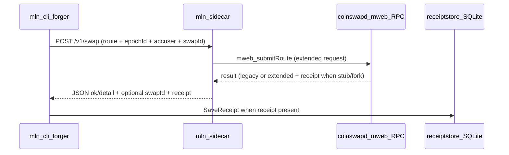

# Taker UX: auto-persist hop receipts for `grievance file`

**Goal:** Close the taker path so `mln-cli forger` persists `ReceiptRecord` into [`mlnd/pkg/receiptstore`](../../mlnd/pkg/receiptstore) SQLite when the sidecar returns receipt JSON, with **metadata threading** (`epochId`, `accuser`, client-generated `swapId`) on the wire through to `research/coinswapd`, so `mln-cli grievance file <swap_id>` works without hand-crafting NDJSON.

**Summary (shipped):** Steps 1–5 are implemented in-tree: extended HTTP/RPC contracts ([`mln-sidecar`](../../mln-sidecar)), forger `-vault` / env ([`mln-cli/cmd/mln-cli/main.go`](../../mln-cli/cmd/mln-cli/main.go), [`mln-cli/internal/forger`](../../mln-cli/internal/forger)), `mlnroute.Request` + `swapService` metadata ([`research/coinswapd`](../../research/coinswapd)), golden receipts in **MockBridge** and **mw-rpc-stub**. Step 6 below remains **fork follow-up** (real hop-failure correlators in `performSwap` / forward path).

**Layer-boundary:** Touches **MWEB** handoff (route JSON, sidecar, stub/fork RPC) and **LitVM** only through receipt preimage fields and existing `grievance file`; does not move stake truth to Nostr or duplicate routing fees on EVM. **Tor** unchanged (transport only).

## Context (design intent)

- **Vault + index:** [`mlnd/pkg/receiptstore/store.go`](../../mlnd/pkg/receiptstore/store.go) — `swap_id`, `SaveReceipt`, `GetBySwapID`.
- **CLI grievance:** [`mln-cli/internal/grievance/file.go`](../../mln-cli/internal/grievance/file.go) `VaultSwapLookup`; env `MLN_RECEIPT_VAULT_PATH`.
- **Taker orchestration:** [`mln-cli/internal/forger`](../../mln-cli/internal/forger) POSTs extended payload; sidecar returns optional `swapId` + `receipt`.
- **Coinswapd:** [`research/coinswapd/mweb_service.go`](../../research/coinswapd/mweb_service.go) persists threaded metadata on `swapService` for future receipt emission; production crypto correlators still tied to peel/forward ([`PHASE_6_BRIDGE_INTEGRATION.md`](../../PHASE_6_BRIDGE_INTEGRATION.md), [`PRODUCT_SPEC.md`](../../PRODUCT_SPEC.md) appendix 13).

**Design bottleneck addressed:** LitVM identity must ride with the route so fork-emitted failure receipts can match `openGrievance` correlators.

## Execution scope (original Steps 1–5)

Step 6 (real hop-failure emission inside coinswapd `performSwap` / forward) remains **documented follow-up**, not a blocker for plumbing + stub E2E.

### 1. Extend the MLN HTTP JSON contract (sidecar + forger)

- Optional fields on swap (and batch where relevant) HTTP responses in [`mln-sidecar/internal/api/server.go`](../../mln-sidecar/internal/api/server.go): top-level `swapId` and nested `receipt` matching [`mlnd/pkg/receiptstore/ndjson.go`](../../mlnd/pkg/receiptstore/ndjson.go).
- Backward compatibility: omit new fields when upstream does not supply them.
- Error paths (e.g. 502): parseable JSON with `ok: false` and optional `receipt` when the engine signals evidence alongside failure.

### 2. Plumb RPC results in `RPCBridge` (sidecar)

- [`mln-sidecar/internal/mweb/rpc_bridge.go`](../../mln-sidecar/internal/mweb/rpc_bridge.go): decode `mweb_submitRoute` `result` — legacy `{"accepted": true}` vs extended `swapId`, `receipt`, `detail`.
- Mirror for `HandleRunBatch` when the fork attaches evidence.
- [`mln-sidecar/internal/mweb/bridge.go`](../../mln-sidecar/internal/mweb/bridge.go): `Bridge` returns structured swap/batch outcomes for HTTP encoding.

### 3. Taker → coinswapd metadata threading (**required**)

**Rationale:** Without `epochId`, `accuser`, and client-generated `swapId` in the routing engine, `ReceiptForDefense` cannot be merged with real MWEB failure data for valid on-chain grievance correlators.

- [`mln-cli/internal/forger/client.go`](../../mln-cli/internal/forger/client.go) `RequestPayload` / `RouteMeta`.
- [`mln-sidecar/internal/mweb/translator.go`](../../mln-sidecar/internal/mweb/translator.go) `SwapRequest` + validation (all three LitVM fields together or none).
- [`research/coinswapd/mlnroute/request.go`](../../research/coinswapd/mlnroute/request.go) + `Validate`; [`research/coinswapd/mweb_service.go`](../../research/coinswapd/mweb_service.go) persists metadata on `swapService`.

### 4. Forger: vault save hook (`mln-cli`)

- `-vault` / `MLN_RECEIPT_VAULT_PATH`; `MLN_RECEIPT_EPOCH_ID`; accuser key (`MLN_ACCUSER_ETH_KEY` / `MLN_OPERATOR_ETH_KEY`).
- Parse `swapId` + `receipt` on success and on HTTP error bodies that include `receipt`; [`receiptstore.SaveReceipt`](../../mlnd/pkg/receiptstore/store.go).

### 5. Stubs and tests (E2E proof)

- [`mln-sidecar/cmd/mw-rpc-stub`](../../mln-sidecar/cmd/mw-rpc-stub) and/or **MockBridge**: golden extended `mweb_submitRoute` result when LitVM metadata is present.
- **Verification:** `go test ./...` in `mln-sidecar`, `mln-cli`, `research/coinswapd/mlnroute` (see [`.cursor/skills/mln-qa/SKILL.md`](../skills/mln-qa/SKILL.md)); manual: `mln-cli forger ... -vault …` → `mln-cli grievance file <swap_id> -vault <same> -dry-run`.

### 6. Fork follow-up (real hop failure)

Production receipts must be emitted where appendix 13 correlators exist (post-peel / forward path), per [`PRODUCT_SPEC.md`](../../PRODUCT_SPEC.md) — not at queue injection. Extend `mweb_runBatch` / `performSwap` / error surfaces in [`research/coinswapd`](../../research/coinswapd) to merge **crypto + threaded metadata** into RPC/NDJSON shapes consumed by the sidecar and forger.

## Out of scope

- Wails desktop UI.
- Operator `mlnd` NDJSON directory bridge (separate path); this slice is **taker-local** vault parity.

## Agent handoff prompt (historical)

Use when re-running or extending this work; this file is the in-repo canonical copy:

> Execute the **Taker vault receipt loop** plan ([`2026-04-07-taker-vault-receipt-loop.md`](2026-04-07-taker-vault-receipt-loop.md)).
>
> **Directives:**
> 1. **Full metadata threading:** `RequestPayload`, `translator.go`, `research/coinswapd/mlnroute/request.go`, validation / `SubmitRoute` storage — `epochId`, `accuser`, `swapId` end-to-end.
> 2. **HTTP/RPC contracts:** Sidecar + `RPCBridge` extended payloads (`swapId`, `receipt`).
> 3. **SQLite save hook:** `mln-cli forger` persists receipt JSON on success and receipt-bearing errors via `SaveReceipt`.
> 4. **Stubs:** `mw-rpc-stub` / **MockBridge** golden receipt; E2E `forger` → SQLite → `grievance file -dry-run`.

## Verification checklist

- `go test ./...` in [`mln-sidecar`](../../mln-sidecar), [`mln-cli`](../../mln-cli), and affected [`research/coinswapd`](../../research/coinswapd) packages.
- Manual: stub/sidecar extended result → `mln-cli forger ... -vault …` → `mln-cli grievance file <swap_id> -vault <same> -dry-run` — accuser key matches receipt.
