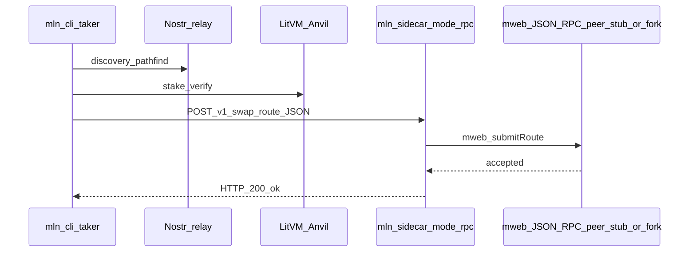
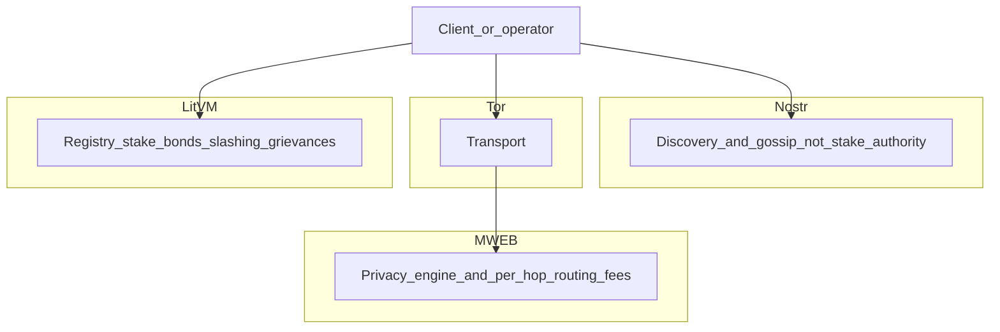

# Phase 16: Public Testnet Readiness

This phase adds **defaults and packaging** so operators and takers can aim at **public Nostr relays** and a **real EVM JSON-RPC** (Sepolia is the in-repo stand-in for HTTP URL + chain ID until official LitVM testnet RPC is published—see [`research/LITVM.md`](research/LITVM.md)). It does **not** replace official LitVM documentation: always confirm **RPC URL, chain ID, WebSocket URL, and explorer** with the LitVM team before production-like runs.

**Local closed-loop testing** remains [`PHASE_12_E2E_CRUCIBLE.md`](PHASE_12_E2E_CRUCIBLE.md) ([`deploy/docker-compose.e2e.yml`](deploy/docker-compose.e2e.yml)).

### MWEB handoff success (Phase 3a, local)

*Sources: [`PHASE_3_MWEB_HANDOFF_SLICE.md`](PHASE_3_MWEB_HANDOFF_SLICE.md); [`AGENTS.md`](AGENTS.md) (MWEB privacy engine vs LitVM registry vs Nostr discovery).*

**2026-04-03:** **`E2E_MWEB_FULL=1 ./scripts/e2e-mweb-handoff-stub.sh`** exercised Nostr + local LitVM (**Anvil**) for scout/pathfind and **`mln-cli` forger** → **`mln-sidecar`** (`GET /v1/balance`, `POST /v1/swap`) → **`mweb_submitRoute`** on **`mw-rpc-stub`** (JSON-RPC stand-in for [`research/coinswapd/`](research/coinswapd/)). Success string on **`0`** exit: **`Phase 3a stub handoff checks passed.`** This playbook (Phase 16) still covers **public** relay + EVM RPC defaults for operators; it does not replace Phase 3a’s local MWEB handoff runbook.

Sequence diagram below follows [`.cursor/skills/mln-architecture-diagrams/SKILL.md`](.cursor/skills/mln-architecture-diagrams/SKILL.md) (layer boundaries per [`AGENTS.md`](AGENTS.md)).



## Layer map (onboarding)

*Sources: [`AGENTS.md`](AGENTS.md) (layer boundaries); [`PRODUCT_SPEC.md`](PRODUCT_SPEC.md) section 9 (P0–P3 roadmap and in-repo implementation status aligned to those layers).*



---

## 1. Protocol admin — deploy and verify contracts

**Prerequisites**

- [Foundry](https://book.getfoundry.sh/getting-started/installation) on your PATH (or use the Docker pattern in [`research/LITVM.md`](research/LITVM.md)).
- A funded deployer key on the target chain (testnet `zkLTC` / native gas per LitVM docs, or Sepolia ETH if you deploy to Sepolia for bring-up).

**Environment**

1. Copy [`contracts/.env.example`](contracts/.env.example) to `contracts/.env` (gitignored).
2. Set **`PRIVATE_KEY`** (deployer; testnet-only key).
3. Set **`RPC_URL`** to the chain’s **HTTP** JSON-RPC endpoint.
4. For verification on an **Etherscan-compatible** explorer (e.g. Sepolia), set **`ETHERSCAN_API_KEY`**.

**Deploy (broadcast)**

From the `contracts/` directory:

```bash
source .env   # or export vars manually
forge script script/Deploy.s.sol:Deploy --rpc-url "$RPC_URL" --broadcast -vvv
```

**Verify (optional)**

On chains supported by Etherscan’s API (including Sepolia):

```bash
forge script script/Deploy.s.sol:Deploy --rpc-url "$RPC_URL" --broadcast --verify \
  --etherscan-api-key "$ETHERSCAN_API_KEY" -vvv
```

If your target is a **custom LitVM testnet** with a different explorer, follow LitVM’s documented verification steps; you may need extra Foundry flags (e.g. custom verifier URL) when they are published.

**After deploy**

- Copy **`MwixnetRegistry`** and **`GrievanceCourt`** addresses from the console output or `contracts/broadcast/` into operator env files and taker wallet settings.
- Distribute **chain ID** and **RPC / WS URLs** to makers and takers (must be consistent across the fleet).

---

## 2. Makers — Docker (`docker-compose.testnet.yml`)

**Goal:** Run **`mlnd`** against **public** LitVM RPC and Nostr relays (no Anvil, no local `nostr-rs-relay`).

1. Copy [`deploy/.env.testnet.example`](deploy/.env.testnet.example) to **`deploy/.env.testnet`** (gitignored).
2. Fill **`MLND_WS_URL`** with a **WebSocket** JSON-RPC URL for the **same chain** as `MLND_LITVM_CHAIN_ID`. Do not use an `https://` HTTP URL here—`mlnd` requires WS.
3. Set **`MLND_REGISTRY_ADDR`**, **`MLND_COURT_ADDR`**, **`MLND_OPERATOR_ADDR`**, **`MLND_NOSTR_NSEC`**, and relays. Optionally set **`MLND_HTTP_URL`** for `make testnet-smoke` / `cast` (see [`mlnd/README.md`](mlnd/README.md)).
4. **`MLND_OPERATOR_PRIVATE_KEY`**: hot key, **testnet-only**, minimal balance; must derive **`MLND_OPERATOR_ADDR`**. See security notes in [`mlnd/README.md`](mlnd/README.md).
5. Register and stake on **`MwixnetRegistry`** per product flow if you are not already registered (not automated in this compose file).

**Start `mlnd`**

From the **repository root**:

```bash
docker compose -f deploy/docker-compose.testnet.yml up -d
```

**Optional mock sidecar** (same as E2E mock: `GET /v1/balance`, `POST /v1/swap` for local taker PoC against your maker host):

```bash
docker compose -f deploy/docker-compose.testnet.yml --profile sidecar up -d
```

Env semantics, Nostr ads, bridge, and defense: [`mlnd/README.md`](mlnd/README.md).

---

## 3. Takers — Wails wallet

**Build**

From the repo root (see [`mln-cli/desktop/README.md`](mln-cli/desktop/README.md)):

```bash
make build-mln-wallet
```

Run the produced **`bin/mln-wallet`** (or `CGO_ENABLED=1 go run -tags=wails ./desktop/` from `mln-cli/` during development).

**Network settings**

The app stores settings under the OS user config directory (`mln-wallet/settings.json`). On first launch, defaults include **public Nostr relays** and a **Sepolia HTTP RPC + chain ID** stand-in ([`mln-cli/internal/config/settings.go`](mln-cli/internal/config/settings.go)). You must still enter:

- **`registryAddr`** (and **`grievanceCourtAddr`** when used by scout)
- **`defaultSidecarUrl`** — point at a trusted **MLN HTTP sidecar** (`GET /v1/balance`, `POST /v1/swap`): local mock from **`--profile sidecar`**, your **`coinswapd`** fork, or a proxy (see [`PHASE_10_TAKER_CLI.md`](PHASE_10_TAKER_CLI.md)).

**Verify state**

- Use the wallet flow: configure network → **scout** (loads kind **31250** ads from relays and checks LitVM registry binding).
- **Balance panel** succeeds only if the sidecar implements **`GET /v1/balance`** for your MWEB/coinswap backend.

**Contrast with local E2E**

Full local matrix (Anvil + local relay + three makers + generated settings): [`PHASE_12_E2E_CRUCIBLE.md`](PHASE_12_E2E_CRUCIBLE.md).

---

## References

| Artifact | Role |
| -------- | ---- |
| [`deploy/docker-compose.testnet.yml`](deploy/docker-compose.testnet.yml) | `mlnd` + optional `mln-sidecar` (profile `sidecar`) |
| [`deploy/.env.testnet.example`](deploy/.env.testnet.example) | Operator env template |
| [`contracts/.env.example`](contracts/.env.example) | Foundry `PRIVATE_KEY`, `RPC_URL`, `ETHERSCAN_API_KEY` |
| [`research/LITVM.md`](research/LITVM.md) | Official RPC, chain ID, explorer sources |
