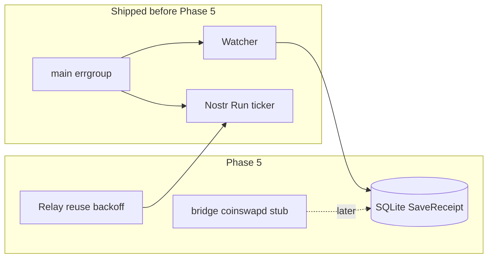

# Phase 5: Nostr polish, Tor URL clarity, receipt bridge (mlnd)

**Checklist**

1. Add root `PHASE_5_NOSTR_TOR_BRIDGE.md` (this file): scope + links.
2. Nostr: persistent relay connections, health via library ping loop, reconnect + backoff on publish/connect failure (`Run(ctx)` unchanged).
3. Tor: test fixture for full URL with port; optional `MLND_TOR_PORT` when `MLND_TOR_ONION` has no explicit port.
4. Bridge: no-op `Run(ctx)` + log first, wire `main` behind `MLND_BRIDGE_COINSWAPD`; later `SaveReceipt` when JSON-RPC/log contract is known.
5. CI-safe integration test (`internal/flow`) + default `go test ./...`; optional Anvil job only if a future test requires it.

**Review:** Scope matches `main`; the older “move broadcaster into `broadcaster.go`” item was obsolete (that code already ships there).

## Reality check vs early Phase 5 drafts

Already implemented before this phase:

- [`mlnd/internal/nostr/broadcaster.go`](mlnd/internal/nostr/broadcaster.go) — kind **31250**, NIP-33 `d` tag, fees, **`MLND_TOR_ONION`** → `content.tor`, **`Run`** with ticker + **`MLND_NOSTR_INTERVAL`**, immediate first publish.
- [`mlnd/cmd/mlnd/main.go`](mlnd/cmd/mlnd/main.go) — **`golang.org/x/sync/errgroup`**: watcher and Nostr **`Run`** share **`gctx`**; SIGINT/SIGTERM **`cancel()`** stops both.

This phase adds **hardening** (relay reuse + backoff), **Tor port helper**, **coinswapd bridge stub**, and **cross-package flow test**.

Tor wire format: [`research/NOSTR_MLN.md`](research/NOSTR_MLN.md) (full URL, e.g. `http://….onion`).

**coinswapd** uses **HTTP JSON-RPC** (`swap_*`), not gRPC — [`research/COINSWAPD_TEARDOWN.md`](research/COINSWAPD_TEARDOWN.md). The bridge will use JSON-RPC and/or log tailing once the “mix completed” surface is stable.

## Deliverables (reference)

### Nostr: connection reuse + backoff

Previously each publish called **`RelayConnect`** and closed the relay. Now: **per-relay `*Relay`** keyed by URL, **`IsConnected()`** checks, **reconnect** after failures, **exponential backoff** before retry. The **`go-nostr`** relay implementation already sends periodic WebSocket pings internally.

### Tor: URL + port

Tests cover **`http://….onion:port`**. Operators may set **`MLND_TOR_PORT`** when **`MLND_TOR_ONION`** has no explicit port (see [`mlnd/README.md`](mlnd/README.md)).

### Receipt bridge stub

[`mlnd/internal/bridge/coinswapd.go`](mlnd/internal/bridge/coinswapd.go): v0 **`Run(ctx)`** logs that the bridge is a no-op and blocks until shutdown. Enable with **`MLND_BRIDGE_COINSWAPD`**. Do not add **`go.mod` `replace`** for gitignored **`research/coinswapd`** until the dependency story is clear ([`AGENTS.md`](AGENTS.md)).

### Integration test scope

[`mlnd/internal/flow`](mlnd/internal/flow) ties **SQLite receipt vault**, **evidence hash**, and **kind-31250** event build — **no** live relays, **no** Anvil requirement, safe for default CI.

Full **coinswapd** + **public relay** e2e stays manual / optional until artifacts and stability allow it.

### CI

[`.github/workflows/mlnd.yml`](.github/workflows/mlnd.yml) continues to run **`go test ./...`** (includes `internal/flow`). No Tor daemon or Docker required for this phase.

## Suggested PR order (incremental)

1. This doc + Tor test / env + Nostr reconnect.
2. Bridge stub + `main` wiring + README.
3. `internal/flow` test (and CI already covers it via `go test ./...`).
