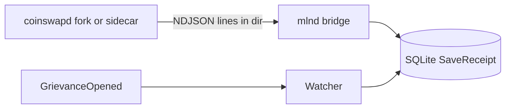

# Phase 6: Real coinswapd receipt bridge + testnet readiness (mlnd)

**Checklist**

1. Add root `PHASE_6_BRIDGE_INTEGRATION.md` (this file): scope, identity-threading note, NDJSON schema, links.
2. **mlnd:** NDJSON directory bridge → `store.SaveReceipt`; env `MLND_BRIDGE_RECEIPTS_DIR`, optional poll interval; wire `main` with `*store.Store`.
3. **Fork/sidecar (parallel):** Patched `coinswapd` or tool emits one JSON object per line (see schema below) including LitVM **`accuser`**, **`epochId`**, peel correlators, **`nextHopPubkey`**, **`signature`**.
4. **Tests:** `internal/flow` — synthetic `GrievanceOpened` fields + `ValidateReceiptForGrievance` + `BuildDefenseData`; `internal/bridge` — line parser + optional ingest test.
5. **Docs:** [`mlnd/README.md`](mlnd/README.md) — bridge env vars, LitVM testnet pointers (no hardcoded RPC in Go; see [`research/LITVM.md`](research/LITVM.md)).

**Review:** Replaces the Phase 5 no-op bridge with file-based ingestion. Full automation requires the fork to emit rows; mlnd is ready before the fork ships.

## Reality check: LitVM metadata must be threaded

[`ValidateReceiptForGrievance`](mlnd/internal/litvm/defense.go) requires the stored receipt to match a future on-chain grievance: same **`accuser`**, **`epochId`**, **`accusedMaker`** (operator), hop correlators, and derived **`evidenceHash`** / **`grievanceId`**. Stock [`coinswapd`](research/COINSWAPD_TEARDOWN.md) `swap_*` paths expose peel math but **not** registry epoch or taker `accuser` address — those come from coordination (wallet, Nostr, or metadata at `Swap`). The fork or a sidecar must **merge** cryptographic receipt fields with LitVM identity fields before mlnd ingests them.

Hash rules: [`research/EVIDENCE_GENERATOR.md`](research/EVIDENCE_GENERATOR.md), [`contracts/src/EvidenceLib.sol`](contracts/src/EvidenceLib.sol).

## NDJSON line schema (v1)

One **JSON object per line** (UTF-8). Files: `*.ndjson` or `*.jsonl` in `MLND_BRIDGE_RECEIPTS_DIR` (non-recursive). Blank lines are skipped.

| Field | Type | Required | Notes |
| ----- | ---- | -------- | ----- |
| `epochId` | string | yes | Decimal `uint256`, e.g. `"99"` |
| `accuser` | string | yes | `0x` + 20-byte hex (taker / grievance opener) |
| `accusedMaker` | string | yes | `0x` + 20-byte hex; must match `MLND_OPERATOR_ADDR` for defense |
| `hopIndex` | number | yes | Integer 0–255 |
| `peeledCommitment` | string | yes | `0x` + 32-byte hex (appendix 13) |
| `forwardCiphertextHash` | string | yes | `0x` + 32-byte hex (`keccak256` of forward ciphertext) |
| `nextHopPubkey` | string | yes | UTF-8 (defense v1) |
| `signature` | string | yes | UTF-8 (defense v1) |

`SaveReceipt` is idempotent on `evidenceHash` (duplicate lines are ignored).

## Deliverables (reference)

### mlnd bridge

[`mlnd/internal/bridge`](mlnd/internal/bridge): parses lines → [`store.ReceiptRecord`](mlnd/internal/store/db.go); tails `*.ndjson` / `*.jsonl` with tracked file offsets; logs parse/`SaveReceipt` errors without stopping the daemon.

### Testnet readiness

Operators copy **current** LitVM testnet RPC, chain ID, and deployed addresses from [LitVM docs](https://docs.litvm.com/) (see [`research/LITVM.md`](research/LITVM.md)). README shows example `export` lines with placeholders only — **no** guessed URLs in Go.

### Fork emission (out of this repo)

Implement append-after-mix (or RPC) in [`research/coinswapd/`](research/coinswapd/) (local clone) per this schema; cross-link from [`research/COINSWAPD_INTEGRATION.md`](research/COINSWAPD_INTEGRATION.md).

### CI

[`.github/workflows/mlnd.yml`](.github/workflows/mlnd.yml): `go test ./...` under `mlnd/` — no `coinswapd` binary, no Anvil requirement for bridge tests.

## Suggested PR order

1. This doc + bridge implementation + `main` + tests + README.
2. Fork NDJSON/RPC emission (separate repository or branch), then operator dry-run on testnet.

## What not to do

- Do not claim end-to-end automation until the fork emits complete lines (crypto + LitVM identities).
- Do not hardcode LitVM testnet RPC or contract addresses in Go without an official source.
- Do not add YAML frontmatter to this file.
