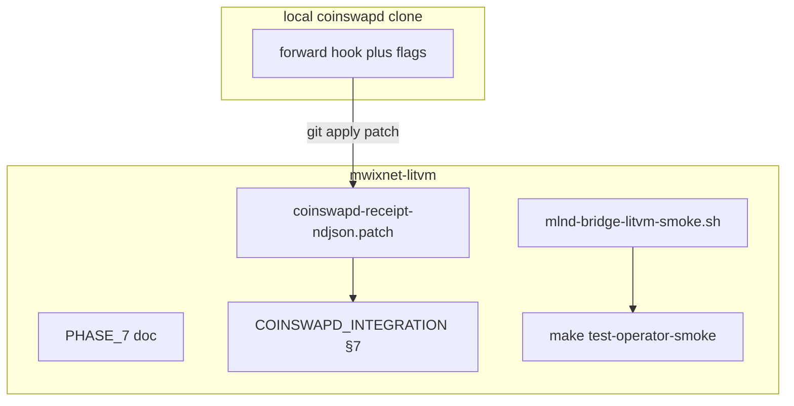

# Phase 7: coinswapd NDJSON emission + local operator smoke

**Checklist**

1. Add root `PHASE_7_END_TO_END.md` (this file): scope, design split, Mermaid, links.
2. **Committable patch:** [`research/coinswapd-receipt-ndjson.patch`](research/coinswapd-receipt-ndjson.patch) for [`ltcmweb/coinswapd`](https://github.com/ltcmweb/coinswapd) — happy-path NDJSON append after `forward` (single-commit batch only in v1).
3. **Research:** Expand [`research/COINSWAPD_INTEGRATION.md`](research/COINSWAPD_INTEGRATION.md) §7 — flags, hook site, `git apply`, sample line, same directory as `MLND_BRIDGE_RECEIPTS_DIR`.
4. **Smoke:** [`scripts/mlnd-bridge-litvm-smoke.sh`](scripts/mlnd-bridge-litvm-smoke.sh) + **`make test-operator-smoke`** — golden NDJSON ([`EvidenceGoldenVectors.t.sol`](contracts/test/EvidenceGoldenVectors.t.sol)) → mlnd bridge → `openGrievance` → log grep for validated receipt (**no** `coinswapd` binary required).
5. **Docs:** [`mlnd/README.md`](mlnd/README.md) — operator runbook + PHASE_7 link; clarify **`make test-full-stack`** is unchanged (grievance + Nostr hints only).

**Review:** mlnd Phase 6 consumer is done. Phase 7 closes the producer side (fork patch) and adds a **fixture-driven** smoke path. Do **not** add YAML frontmatter to this file.

## Reality check (accurate to repo)

- **mlnd** ingests NDJSON per [PHASE_6_BRIDGE_INTEGRATION.md](PHASE_6_BRIDGE_INTEGRATION.md).
- **[`research/coinswapd/`](research/coinswapd/)** is **gitignored**; this repo ships a **patch** plus docs, not the fork tree.
- **[`make test-full-stack`](Makefile)** and [`.github/workflows/test-full-stack.yml`](.github/workflows/test-full-stack.yml) must stay as today — grievance script + Nostr echo. Operator smoke is **`make test-operator-smoke`** only.

## Design split

**A. coinswapd fork (producer)**  
After `cipher.XORKeyStream` on the forward blob in [`forward()`](https://github.com/ltcmweb/coinswapd/blob/master/swap.go) (post-XOR bytes = `P` for `forwardCiphertextHash` per [PRODUCT_SPEC.md](PRODUCT_SPEC.md) appendix 13 / [research/EVIDENCE_GENERATOR.md](research/EVIDENCE_GENERATOR.md)), append one JSON line if `--mln-receipt-dir` is set and `len(commits)==1`. **`peeledCommitment`** uses `sha256` over the canonical **33-byte** compressed Pedersen encoding of `commit2` (appendix 13.3). LitVM **`epochId`**, **`accuser`**, **`accusedMaker`**, **`nextHopPubkey`**, **`signature`** come from **new flags** (not inferred from MWEB alone).

**B. Repo smoke (no MWEB)**  
[`scripts/mlnd-bridge-litvm-smoke.sh`](scripts/mlnd-bridge-litvm-smoke.sh) writes the **golden** NDJSON row matching [`scripts/test-grievance-local.sh`](scripts/test-grievance-local.sh) / [`EvidenceGoldenVectors.t.sol`](contracts/test/EvidenceGoldenVectors.t.sol) (`hopIndex` **2**, peeled / forward correlators `0x…1111` / `0x…2222`), runs mlnd with the bridge, opens the same grievance on Anvil, and asserts mlnd logged a **validated receipt**.

## Deliverables (reference)

### Patch + fork

- Apply against **upstream** `ltcmweb/coinswapd` `master` (or your fork’s aligned branch). If hunks fail after drift, rebase manually using §7 hook description.
- v1 **only** emits when a single forward batch (`len(commits)==1`); multi-onion forwards are skipped (logged or silent).

### Smoke script

- Requires: Anvil on `ANVIL_RPC_URL`, `cast` **or** Docker Foundry image, `python3`, **`go` 1.22+** on `PATH` (for `go run ./mlnd/cmd/mlnd`). Does not run Docker for mlnd by default.
- **Optional CI:** not enabled by default (Go + Anvil + timing); run locally or add a workflow later if flakiness is acceptable.

### What not to do

- Do not add YAML / `isProject` metadata to root phase markdown.
- Do not redefine **`test-full-stack`** without updating CI and all doc references.
- Do not claim **real MWEB mix in CI** in this phase; smoke uses golden vectors only.

## Suggested PR order

1. `PHASE_7_END_TO_END.md` + patch + §7 + smoke script + Makefile + `mlnd/README.md` (this PR).
2. Verify patch applies to a fresh `research/coinswapd/` clone; adjust hunks if upstream moved.
