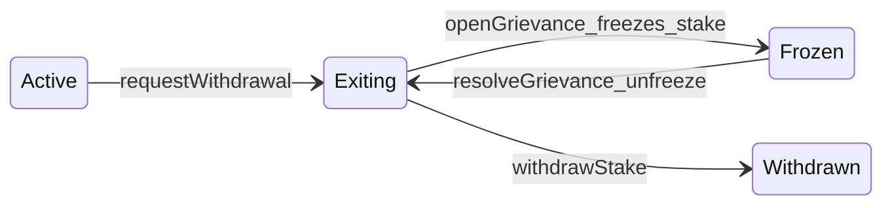

# Mwixnet × LitVM × Nostr — Product Specification

**Working title:** MLN Stack (MWEB privacy engine + LitVM economics + Nostr coordination)  
**Version:** 0.1  
**Status:** Draft — architecture and requirements; implementation details TBD  

---

## 1. Purpose

Deliver a **trust-minimized** path for Litecoin **MWEB** users to run **CoinSwap-style** mixing (per the [Mimblewimble CoinSwap proposal](https://forum.grin.mw/t/mimblewimble-coinswap-proposal/8322)) without relying on a single human coordinator. Economic security and programmable enforcement live on **[LitVM](https://docs.litvm.com/)** (EVM L2 on Litecoin). **Discovery and transport** stay off expensive, permanent L2 state and use **Nostr** and **Tor** so metadata and IP-level linkability do not undermine privacy goals.

**Reference implementations / background**

- [mimblewimble/mwixnet](https://github.com/mimblewimble/mwixnet) — CoinSwap server reference (Grin-oriented; design informs MWEB adaptation).
- [LitVM documentation](https://docs.litvm.com/) — testnet, bridging, EVM tooling (Foundry/Hardhat).
- [ltcmweb](https://github.com/ltcmweb) on GitHub — Litecoin/MWEB-related forks and modules; see **§12 Appendix** for a curated list.

---

## 2. Design principles


| Principle                            | Implication                                                                                                                  |
| ------------------------------------ | ---------------------------------------------------------------------------------------------------------------------------- |
| **Non-custodial MWEB**               | Mix nodes never take ownership of user coins; failed mixes leave UTXOs unspent on L1/MWEB.                                   |
| **Separation of concerns**           | L2 handles **value and rules**; Nostr handles **discovery and gossip**; Tor handles **network anonymity**.                   |
| **Minimal permanent metadata on L2** | Avoid high-frequency heartbeats and rich routing metadata on-chain; reduces long-term correlation risk and cost.             |
| **Cryptographic accountability**     | Slashing and fee release depend on verifiable claims (signatures, timeouts, optional L1/MWEB proofs), not manual moderation. |


---

## 3. Layered architecture


| Layer                             | Technology                                       | Role                                                                                                                   |
| --------------------------------- | ------------------------------------------------ | ---------------------------------------------------------------------------------------------------------------------- |
| **Privacy engine**                | Litecoin **MWEB** (Mimblewimble extension block) | Self-spends, commitments, kernels, CoinSwap math per MWixnet-style protocol.                                           |
| **Economic / enforcement**        | **LitVM** (zk rollup, EVM)                       | Staking (`zkLTC` or bridged test LTC), escrows, slashing, bounties, optional proof-verification hooks.                 |
| **Discovery & reputation gossip** | **Nostr**                                        | Node advertisements, fee quotes, signed failure notices, wallet-readable reputation signals (not authoritative stake). |
| **Transport**                     | **Tor** (.onion)                                 | Hide client ↔ node IP linkage; onion payloads align with MWixnet-style layered encryption.                             |


LitVM is **not** a replacement for Nostr or Tor: blockchains are public, costly, and ill-suited for frequent discovery pings; EVM does not provide IP anonymity.

---

## 4. Roles


| Role                 | Responsibility                                                                                                                                         |
| -------------------- | ------------------------------------------------------------------------------------------------------------------------------------------------------ |
| **Taker (user)**     | Confirms amount and policy; wallet auto-selects hop list, builds MWixnet onion / swap request; pays MWEB routing fees per agreed model; may initiate grievances with evidence. |
| **Maker (mix node)** | Participates in multi-hop processing, range proofs, sorting, kernel leg per protocol; registers stake on LitVM; publishes reachability/fees via Nostr. |
| **Swap server (N1)** | In classic MWixnet, entry node accepting `swap` API; validates inputs against UTXO set (adapt to MWEB rules).                                          |
| **Mixers (N2…Nn)**   | Transform and sort commitments; forward inner onion layers.                                                                                            |


**Multi-taker batches:** Privacy scales with **anonymity set size**; the protocol targets batched epochs (time- and/or size-based), not isolated pairwise swaps, aligned with the [forum proposal](https://forum.grin.mw/t/mimblewimble-coinswap-proposal/8322).

### 4.1 User stories, taker UX, and coordination

Product-level **user stories**, the **coordination model** (batched epochs, taker queue, dynamic makers), **epoch semantics** (schedule, timezone, and `epochId` mapping for grievances), and **wallet automatic route policy** (PoC defaults) are documented in [`research/USER_STORIES_MLN.md`](research/USER_STORIES_MLN.md). In short:

- **Takers** seek to break input/output linkability with **minimal steps** and **low MWEB fees**; the **wallet** auto-builds hop lists from **Nostr** discovery and **LitVM** stake verification rather than manual hop selection.
- **Makers** publish replaceable advertisements on Nostr; **stake** and identity binding remain authoritative on LitVM.
- **Epochs** may be time-based (e.g. daily midnight, implementation-defined) and/or size-based; **`epochId`** used in grievances and in the appendix 13 preimage must match the same convention in wallet and node software (see research note).

---

## 5. LitVM: registry and economics (conceptual)

### 5.1 Registry / staking

- Makers **deposit** a minimum stake in a registry contract (e.g. `MwixnetRegistry`-class), denominated in **bridged LTC / `zkLTC`** on LitVM testnet.
- Registration binds **identity used off-chain** (e.g. Nostr public key, Tor onion URL) to an **on-chain stake record** so wallets can filter “verified” operators by stake size and lock duration.
- **Timelocked exit queue (maker unstaking):** Under optimistic execution, a maker must **not** be able to **instant-withdraw** stake after misbehaving in an epoch and before takers can file grievances. The registry therefore uses a **cooldown** between **exit intent** and **final withdrawal**, combined with the grievance challenge window (section 6).

#### 5.1.1 Unstaking lifecycle (product + contract sketch)

1. **Signal exit — `requestWithdrawal()`**  
   - **Off-chain:** The maker stops publishing their `mln_maker_ad` to Nostr relays so wallets no longer route new onions through them in future epochs.  
   - **On-chain:** The maker calls `requestWithdrawal()` on `MwixnetRegistry`. Stake remains locked; an **unlock time** is set at `block.timestamp + T_cooldown`. Open grievances against the maker must be **absent** (and the judicial contract must be wired).

2. **Cooldown — `T_cooldown`**  
   Stake stays locked for a mandatory period. **Parameter constraint:** `T_cooldown` must be **strictly greater** than the **maximum epoch length** plus the **challenge window** `T_challenge` (section 6.5). Example: if the longest epoch is 24 hours and `T_challenge` is 24 hours, then `T_cooldown` ≥ 48 hours. This ensures that if the maker sabotaged their last epoch before exiting, affected parties still have time to open an `openGrievance` while stake remains subject to slash policy.

3. **Settlement — `withdrawStake()`**  
   - **Clean exit:** If no open grievance froze the stake and `block.timestamp` ≥ unlock time, the maker calls `withdrawStake()` and receives remaining `zkLTC` (full balance in the current scaffold; production may deduct protocol fees). Registration and exit state are cleared.  
   - **Interrupted exit:** If a grievance opens while the maker is exiting, **stake is frozen** (via `GrievanceCourt`) and final withdrawal waits until `resolveGrievance`. On an **upheld** grievance, **`GrievanceCourt`** calls **`MwixnetRegistry.slashStake`**: a **`slashBps`** fraction of the accused stake is removed and split per **`bountyBps` / `burnBps`** (bounty to accuser, remainder **burned** to `address(0)`). A **treasury** leg from the section 6.3 policy table is **not** in the reference contracts—only bounty and burn. After any resolution affecting the accused, **`withdrawalLockUntil`** plus **`slashingWindow`** can block **`requestWithdrawal` / `withdrawStake`** even after unfreeze. **Not audited**; on-chain **`defenseData`** verification remains **TBD** (section 6.5). See [`PHASE_15_ECONOMIC_HARDENING.md`](PHASE_15_ECONOMIC_HARDENING.md).

**Non-makers:** Addresses that **deposit** but never call `registerMaker` may **partial-withdraw** without the exit queue (testing and non-operator liquidity). Once registered as a maker, **partial instant withdraw is disabled**; only `requestWithdrawal` → cooldown → `withdrawStake` applies.

Reference implementation: [`contracts/src/MwixnetRegistry.sol`](contracts/src/MwixnetRegistry.sol) (`cooldownPeriod`, `requestWithdrawal`, `withdrawStake`), with [`contracts/src/GrievanceCourt.sol`](contracts/src/GrievanceCourt.sol) exposing `openGrievanceCountAgainst` for exit gating.



### 5.2 Fee payment problem (taker → makers)

**Constraint:** Paying each maker in a naïve way can weaken privacy or linkability; the concrete design depends on whether routing uses **native MWEB economics** or an **additional** L2 rail.

**Baseline (confirmed in `[coinswapd](https://github.com/ltcmweb/coinswapd)`):** **Fees inside the MWixnet / MWEB fee budget** — each hop carries `KernelBlind`, `StealthBlind`, and `Fee`; nodes aggregate blinds, take a **per-node share** of the standard MWEB weight fee, and realize the remainder as an **MWEB output** to the operator address plus matching **kernels** (`backward` / `finalize` in `coinswapd`). **No EVM involvement** is required for per-hop routing compensation in this model.

**LitVM Phase 1 (recommended for MLN): hybrid — v1 product decision**

- **Routing fees:** Continue to settle **on MWEB** as above unless you deliberately add a second fee rail.
- **LitVM:** Use `**zkLTC` / bridged LTC** primarily for **registry stake, security deposits, slashing, and bounties** — not for passing per-hop fee shares on-chain. That matches a **deposit/slash pool** without duplicating fee logic in Solidity.
- **v1 scope:** **No extra LitVM fee escrow** for per-hop routing or mix compensation. LitVM carries **stake, grievance bonds, slash/bounty accounting** only; routing fees stay **MWEB-only** as in §5.2 baseline. A future **LitVM escrow** for fees **off** the MWEB graph remains an **optional** product add-on, not part of v1.

### 5.3 Failure and griefing (makers mid-mix)

- If a mix **fails**, takers’ funds remain **unspent** (non-custodial); they suffer **delay and opportunity cost**, not theft.
- Honest makers may **waste work** and see **no fee** if settlement is contingent on final broadcast — unless the spec adds **partial compensation** from slashed stakes (below).

---

## 6. Slashing, grievances, and peer enforcement

### 6.1 Goals

- Punish **liveness failures** and **provable misbehavior** without a central admin.
- Allow **other makers** (not only the taker) to participate in evidence and **bounty** distribution.
- Deter **false reports** (e.g. colluding makers framing an honest node).

### 6.2 Evidence model (high level)

Typical ingredients (exact cryptography TBD):

- **Epoch / round binding:** signed intent that nodes participated in a specific batch (hash, time window, participant set).
- **Hop receipts:** signed messages between adjacent makers (and optionally taker) proving handoff or non-handoff within timeouts.
- **Taker co-sign:** grievance may require **taker** confirmation of failure to reduce false-flagging by peers alone.
- **Challenge window:** accused maker can respond on-chain or via signed message within **T_challenge**; failure → slash; successful defense → reporter penalty if applicable.

**Concrete contract-level state transitions and bond economics:** §6.5.

### 6.3 Slash distribution (example policy)


| Recipient                     | Rationale                                              |
| ----------------------------- | ------------------------------------------------------ |
| **Affected takers**           | Inconvenience / retry gas or fee credits on L2.        |
| **Honest makers (witnesses)** | Whistleblower / liveness bounty (e.g. 10–25% split).   |
| **Burn or treasury**          | Remainder to limit collusion and fund protocol health. |


Parameters are **governance/engineering knobs**, not fixed in this draft.

### 6.4 Nostr role

- **Not** source of truth for stake (LitVM is).  
- **Carries** signed operational events: heartbeats, fee schedules, **public accusations with hashes** pointing to on-chain cases, optional reputation summaries computed by wallets.
- **Normative wire (event kinds, JSON schemas, identity binding to `makerNostrKeyHash`):** see `research/NOSTR_MLN.md` (Phase 2 v1 profile; CI fixtures in `nostr/`).

### 6.5 LitVM challenge window (judicial layer only)

Per §5.2, **per-hop routing fees** settle on **MWEB**; successful mixes stay **off** LitVM. The rollup contract is a **judicial layer**: it activates only when someone alleges **liveness failure** or **misconduct** after an epoch. The EVM must **not** attempt to verify happy-path mix execution (prohibitively expensive and metadata-leaky).

#### State machine (plain English)


| State                    | Meaning                                                                                                                                                                                       |
| ------------------------ | --------------------------------------------------------------------------------------------------------------------------------------------------------------------------------------------- |
| **Normal**               | Maker stake is withdrawable per registry rules; no grievance open.                                                                                                                            |
| **Grievance open**       | An accuser posted a bond and committed to an **evidence** claim; accused stake is **frozen for withdrawal** (not necessarily “slashed” yet — exact freeze scope is an implementation detail). |
| **Defense window**       | Countdown **T_challenge** (e.g. 24 hours) during which the accused may submit a defense.                                                                                                      |
| **Resolved — slash**     | Accused failed to defend in time or defense rejected → slash per policy; grievance bond handling per outcome.                                                                                 |
| **Resolved — exonerate** | Valid defense → accused cleared; false accuser may forfeit bond per policy.                                                                                                                   |


**Default if the accused is silent:** treat as **failed defense** (slash or deregister), not as automatic exoneration — the window exists so honest makers can **prove** handoff or broadcast.

#### 1. Accusation — `openGrievance`

**Who:** Primarily a **Taker** who observed no final MWEB tx for the epoch, or an **upstream Maker** who believes a downstream peer dropped the payload (see §6.1–6.2).

**On-chain submission (minimal):**

- `**accused`:** Registry identity of the blamed maker (e.g. `address` of the staked operator).
- `**epochId`:** Agreed batch identifier (contract-defined epoch counter, timestamp bucket, or hash committed elsewhere — must match wallet/node software).
- `**evidenceHash`:** Single **commitment** to the canonical preimage (see **§13**). The contract stores the hash only; **bytes are not uploaded** in the happy path.

**Anti-spam:** Accuser locks a **Grievance bond** in `**zkLTC`** (amount a governance parameter). If the grievance is judged **frivolous or false**, this bond is **forfeited** (e.g. to the accused or protocol). If **true**, the bond is **returned** and a **bounty** may be paid from the slashed stake.

#### 2. Defense window — `defendGrievance` (duration **T_challenge**)

While open, the accused **cannot** rely on “do nothing” if the protocol defines **default slash on timeout**.

**Valid defenses (conceptual — payloads verified off-chain or via pluggable verifiers):**

1. **Proof of handoff:** Cryptographic proof that the accused **passed** the correct state to the **next** hop (e.g. signed receipt, transcript hash agreed with peer keys). Shows failure **downstream** of the accused.
2. **Proof of broadcast:** Evidence that the **aggregated MWEB transaction** (or the relevant kernel / output set) **did** land on Litecoin — e.g. **SPV-style inclusion**, **optimistic oracle attestation**, or **N-of-M maker attestation** if L1 proofs are deferred (see §10.2).

The contract may accept `**defenseData`** as opaque calldata interpreted by a **thin validation hook** (e.g. verify signatures of fixed format) or defer detailed checks to **Phase 2** oracle modules.

#### 3. Resolution — `resolveGrievance`


| Outcome                                      | Maker behavior                          | Economic result (example policy)                                                                                                                                            |
| -------------------------------------------- | --------------------------------------- | --------------------------------------------------------------------------------------------------------------------------------------------------------------------------- |
| **A — No timely defense or invalid defense** | Treated as **liable**                   | Slash stake per policy; **accuser** recovers grievance bond + **bounty** (e.g. 10% of slashed amount); remainder **burn** or **treasury**; optional **deregister** accused. |
| **B — Valid defense**                        | **Exonerated**; withdrawal rules resume | Accuser’s grievance bond **forfeited** to accused (or split) to cover gas and reputational harm; stake **unlocked**.                                                        |


Exact percentages are **parameters**, not consensus of this draft.

#### Minimal Solidity scaffolding (mental model)

Units (wei vs `zkLTC` decimals) and upgradeability are **out of scope**; this sketches **storage and flow** only.

```solidity
// SPDX-License-Identifier: Apache-2.0
// Minimal scaffolding — not audited; bond amounts are placeholders.

struct Grievance {
    address accuser;
    address accused;
    uint256 epochId;
    bytes32 evidenceHash;
    uint256 openedAt;
    uint256 deadline;
    GrievancePhase phase;
}

enum GrievancePhase { None, Open, Defended, ResolvedSlash, ResolvedExonerate }

mapping(bytes32 grievanceId => Grievance) public grievances;

uint256 public constant CHALLENGE_WINDOW = 24 hours; // T_challenge
// uint256 public grievanceBond; // set per token decimals in constructor

function openGrievance(address accused, uint256 epochId, bytes32 evidenceHash) external;
function defendGrievance(bytes32 grievanceId, bytes calldata defenseData) external;
function resolveGrievance(bytes32 grievanceId) external;
```

`**grievanceId`:** Derive deterministically from `(accuser, accused, epochId, evidenceHash)` (or include a **nonce** if multiple grievances per triple are allowed).

#### Sequencing: what to specify first — `evidenceHash` vs L1 oracle

**Tighten the cryptographic layout of `evidenceHash` first.**

- The contract only ever sees **hashes** and optional **structured calldata**; every defense path depends on **what was committed** at `openGrievance`. Without a fixed **canonical encoding** of “what failure is alleged” (epoch, hop index, onion commitment, RPC id, signed receipt digests), an oracle cannot know what to prove.
- The **L1 / MWEB proof** path is **harder and optional for v1**: you can ship a **receipt-only** judicial model (signed hop transcripts + timeout) and add **SPV/oracle verification** as an upgrade or external `defenseData` verifier later.
- **Oracle / bridge** design (§10.2) should follow once **evidence types** are frozen — otherwise the oracle API churns.

---

## 7. Coordination: what replaces a single “coordinator”

- **No single human batcher** is required for *authority*; **epoch scheduling** can be **contract-gated**, **time-based**, or **Nostr-agreed** (open participation).
- **Nostr relays** provide **message transport** (bulletin board), not trusted ordering of MWEB state.
- **LitVM** can hold **round parameters** (epoch id, merkle root of participant commitments) if needed without stuffing high-frequency discovery data on-chain.

### 7.1 Epoch scheduling and `epochId`

Implementations must define how **calendar or counter epochs** map to the **`epochId`** field used in `openGrievance`, the appendix 13 **`evidenceHash`** preimage, and wallet/node batching so that disputes bind to the correct round. **Normative guidance** (timezone anchor, cutover instant, optional ordinal vs time-bucket `epochId`) lives in [`research/USER_STORIES_MLN.md`](research/USER_STORIES_MLN.md) (“Epoch semantics”).

---

## 8. Privacy and threat model (summary)


| Threat                                  | Mitigation                                                                                                   |
| --------------------------------------- | ------------------------------------------------------------------------------------------------------------ |
| **Single dishonest maker learns links** | MWixnet-style design: **≥1 honest** node in path limits global linking (per proposal); Tor + onion layering. |
| **Sybil makers**                        | Minimum **L2 stake** + optional **lock duration**; wallet policy filters low stake.                          |
| **Discovery surveillance**              | Prefer **ephemeral** Nostr strategy; avoid putting IPs on LitVM.                                             |
| **Collusion to slash**                  | Multi-party evidence + **taker** sign-off + **challenge** + penalties for false reports.                     |
| **L2 bridge / contract risk**           | Smart contract and bridge bugs are **orthogonal** to MWixnet math — scope audits and testnet iteration.      |


---

## 9. Roadmap (phased)


| Phase                     | Focus                                                                                                           | Outcomes                                                                                                                                                                                             |
| ------------------------- | --------------------------------------------------------------------------------------------------------------- | ---------------------------------------------------------------------------------------------------------------------------------------------------------------------------------------------------- |
| **P0 — Protocol clarity** | Map Grin mwixnet flows to **MWEB** (inputs, ownership proofs, fees).                                            | **§14** (MWEB tx appendix) + gap analysis vs [mwixnet](https://github.com/mimblewimble/mwixnet) **and** native MWEB codepaths (`[coinswapd](https://github.com/ltcmweb/coinswapd)`, `[mwebd](https://github.com/ltcmweb/mwebd)`). |
| **P1 — LitVM testnet**    | Deploy **registry + escrow/slash** prototype; faucet/`zkLTC` per [LitVM testnet docs](https://docs.litvm.com/). | Contract addresses + ABI; basic maker registration.                                                                                                                                                  |
| **P2 — Nostr profile**    | Define event kinds / NIP profile for **maker ads + grievance pointers**.                                        | Interop with one wallet PoC.                                                                                                                                                                         |
| **P3 — Integration**      | End-to-end: Nostr discover → Tor connect → MWixnet round → L2 settlement/slash path.                            | Testnet demo script.                                                                                                                                                                                 |

**Implementation status (this repository, relative to P0–P1 product work):** The following are **shipped in-tree** and align with the product layers above: **`mln-cli`** (Go taker client: scout, pathfind, forger; **maker-operator** `maker onboard` for LitVM **`deposit` / `registerMaker`** — dry-run by default), **Wails desktop wallet**, **`mln-sidecar`** HTTP bridge with **`-mode=mock`** and **`-mode=rpc`** forwarding to JSON-RPC **`mweb_submitRoute`** / **`mweb_getBalance`** / **`mweb_getRouteStatus`** / **`mweb_runBatch`** (HTTP **`/v1/balance`**, **`/v1/swap`**, **`/v1/route/status`**, **`/v1/route/batch`** — see [`mln-sidecar/README.md`](mln-sidecar/README.md)), a **tracked [`research/coinswapd/`](research/coinswapd/) fork** implementing those RPCs for MLN route handoff (see [`research/COINSWAPD_MLN_FORK_SPEC.md`](research/COINSWAPD_MLN_FORK_SPEC.md)), **optional `mlnd` loopback Maker dashboard** (status JSON + SSE when **`MLND_DASHBOARD_ADDR`** is set; see [`mlnd/MAKER_DASHBOARD_SETUP.md`](mlnd/MAKER_DASHBOARD_SETUP.md)), **LitVM contract economic hardening** (Phase 15: slashing, bonds, exit locks, reentrancy guard; Foundry fuzz invariants), **Slither** in [`.github/workflows/contracts.yml`](.github/workflows/contracts.yml), and **security posture documentation** ([`research/THREAT_MODEL_MLN.md`](research/THREAT_MODEL_MLN.md) acceptance snapshot and threat tables; [`research/RED_TEAM_MLN.md`](research/RED_TEAM_MLN.md) adversarial narratives — not a separate audit). **P2 Nostr profile (v1):** kinds **31250–31251**, [`research/NOSTR_MLN.md`](research/NOSTR_MLN.md), golden fixtures + [`nostr/validate_fixtures.py`](nostr/validate_fixtures.py) + wire-helper check in [`.github/workflows/nostr-fixtures.yml`](.github/workflows/nostr-fixtures.yml), **`mln-cli` Scout** (registry + optional court filter + on-chain `nostrKeyHash`), and **`mlnd`** maker-ad publishing — see [`PHASE_2_NOSTR.md`](PHASE_2_NOSTR.md). **Toward P3 integration (no official LitVM testnet required):** **Phase 3a** (HTTP → JSON-RPC route handoff) is **verified** with **`bin/mw-rpc-stub`**, **`mln-sidecar -mode=rpc`**, and **`E2E_MWEB_FULL=1 ./scripts/e2e-mweb-handoff-stub.sh`** (Nostr scout + pathfind + forger: **`mweb_submitRoute`**, **`mweb_runBatch`**, **`mweb_getRouteStatus`** via sidecar **`/v1/route/batch`** + **`/v1/route/status`** and **`mln-cli` `-trigger-batch` / `-wait-batch`**) as of **2026-04-03** — see [`PHASE_3_MWEB_HANDOFF_SLICE.md`](PHASE_3_MWEB_HANDOFF_SLICE.md). A **built [`research/coinswapd/`](research/coinswapd/)** binary (**`make build-research-coinswapd`**) can replace the stub for host JSON-RPC smoke (**`MWEB_RPC_BACKEND=coinswapd`** in the same script; Neutrino / keys / UTXO still operator concerns); operator smoke **passed** **2026-04-03** (**`mweb_getBalance`** via sidecar OK; stub **`POST /v1/swap`** → expected **502**). **`mln-sidecar`** and **`mln-cli` forger** normalize bare **`*.onion`**-style hop strings to **`http://`** for **`rpc.Dial`**, and **`mln-cli pathfind`** requires non-empty maker **`tor`** fields. **Full P3** (live Tor, **P2P `swap_forward`/`swap_backward`** among real makers, LitVM slash path on a public deployment) remains open; an **in-repo** submit → **`mweb_runBatch`** → **`pendingOnions=0`** round-trip is **verified** on **`mw-rpc-stub`** + **`E2E_MWEB_FULL=1`** ([`PHASE_3_MWEB_HANDOFF_SLICE.md`](PHASE_3_MWEB_HANDOFF_SLICE.md)). **Funded `coinswapd-research` smoke:** **`E2E_MWEB_FUNDED=1 ./scripts/e2e-mweb-handoff-stub.sh`** with real **`MWEB_SCAN_SECRET` / `MWEB_SPEND_SECRET`**, **`E2E_MWEB_DEST`**, **`E2E_MWEB_AMOUNT`** (exact UTXO match), and Nostr routes carrying **`swapX25519PubHex`** (bootstrap sets **`MLND_SWAP_X25519_PUB_HEX`** per maker); optional **`E2E_MWEB_FUNDED_DEV_CLEAR=1`** enables fork flag **`-mweb-dev-clear-pending-after-batch`** so **`pendingOnions`** returns to **0** after batch **without** chain finalize (**DEV ONLY** — see [`research/COINSWAPD_MLN_FORK_SPEC.md`](research/COINSWAPD_MLN_FORK_SPEC.md) §2.7a). **Still open for P0-class closure:** **end-to-end** MWEB mix execution **validated** with **`mln-sidecar -mode=rpc`** and real nodes (Phase 3 integration), continued **fork hardening** versus upstream **ltcmweb**, and operational controls in the threat model (keys, sidecar bind, `defenseData` verification on-chain). The public **ltcmweb** reference is **Go** ([coinswapd](https://github.com/ltcmweb/coinswapd)); vanilla RPC is **`swap_Swap(onion.Onion)`** only (see [`research/COINSWAPD_TEARDOWN.md`](research/COINSWAPD_TEARDOWN.md)). Older notes sometimes say “C++ engine”; treat the **fork contract** (`mweb_submitRoute`) as normative, not the language label. **P1 on-chain:** LitVM **public testnet broadcast** of registry + court remains pending RPC/faucet readiness (see [`README.md`](README.md)).


---

## 10. Open questions

1. **MWEB vs Grin:** Baseline **MWEB transaction and onion-layer** mapping for the `coinswapd` path is in **§14**. Remaining chain-level details (consensus, reorgs) still defer to **ltcd** / Litecoin docs; Grin **types and UTXO rules** must not be assumed without that mapping.
2. **L1 proof on LitVM (TBD):** Whether the rollup or an oracle verifies **Litecoin block inclusion** / MWEB kernel presence for **“proof of broadcast”** defenses (§13.6) — light client, trusted oracle, N-of-M maker attestation, or deferred challenge — is **not fixed**. A **receipt-only** judicial path (signed hop receipts + timeout, §6.5) can ship **without** L1 verification in v1.
3. **Canonical evidence:** **§13** defines the packed preimage; **validate** field computations and wire-byte choices against the **node implementation** (including any team fork) and wallet logging **before** freezing registry contract ABIs.
4. **Fee rail:** **Resolved for v1** — **hybrid only**; **no** LitVM fee escrow for per-hop routing (§5.2). Optional future L2 fee rail remains out of scope until explicitly specified.
5. **Cashu / Lightning:** Prior discussion mentioned **Cashu** for layered fees; if retained, specify **mint trust model** vs pure `zkLTC` escrows.

---

## 11. Success criteria (product)

- Takers can **discover** staked makers without a central server (Nostr + on-chain stake query).
- Makers can **register** and **lock** stake on LitVM testnet.
- Failed or abandoned mixes have a **documented** non-custodial outcome; **slashing/bounty** rules are **implementable** in Solidity with clear fraud/challenge assumptions.
- Documentation clearly states **what privacy guarantees hold** if **all** makers collude vs **at least one** honest maker (aligned with [tromp’s proposal](https://forum.grin.mw/t/mimblewimble-coinswap-proposal/8322)).

---

## 12. Appendix: [ltcmweb](https://github.com/ltcmweb) repositories (research)

The org currently exposes **21** public repositories (per GitHub API). Below is a **priority-ordered** subset for the MLN stack (Phase 0–1). Several forks are **archived**; treat them as historical reference unless actively maintained.

### Tier A — Directly on the critical path


| Repository                                            | Why read it                                                                                                                                                                                                                    |
| ----------------------------------------------------- | ------------------------------------------------------------------------------------------------------------------------------------------------------------------------------------------------------------------------------ |
| **[coinswapd](https://github.com/ltcmweb/coinswapd)** | Described as a **CoinSwap server for MWEB** — closest native analogue to Grin’s mwixnet for Litecoin; first place to compare protocol messages, batching, and server behavior vs your spec.                                    |
| **[mwebd](https://github.com/ltcmweb/mwebd)**         | **“Module for adding MWEB capabilities to any application”** (Go). Likely home for **commitments, kernels, ownership proofs, and tx construction** primitives your **makers** would reuse instead of reimplementing MW crypto. |
| **[neutrino](https://github.com/ltcmweb/neutrino)**   | **Privacy-preserving Litecoin light client** — starting point for **SPV-style header/merkle proofs**, filters, and “what would an oracle or verifier need?” for §10 (L1/MWEB inclusion).                                       |
| **[ltcd](https://github.com/ltcmweb/ltcd)**           | **Full Litecoin node in Go** — consensus and chain data ground truth; use when neutrino-level detail is insufficient or you need full-block validation semantics.                                                              |


### Tier B — Taker / wallet UX and signing models


| Repository                                                          | Notes                                                                                                                                                          |
| ------------------------------------------------------------------- | -------------------------------------------------------------------------------------------------------------------------------------------------------------- |
| **[cake_wallet](https://github.com/ltcmweb/cake_wallet)**           | Active multi-asset wallet codebase; useful for **how a mobile taker** builds and signs flows (validate MWEB/LTC scope in branches).                            |
| **[app-ltcmweb](https://github.com/ltcmweb/app-ltcmweb)**           | **Ledger Nano** MWEB app — hardware signing and constrained UX; different constraints than hot wallets.                                                        |
| **[electrum-ltc](https://github.com/ltcmweb/electrum-ltc)**         | README states the repo **moved** to [ltc-electrum/electrum-ltc](https://github.com/ltc-electrum/electrum-ltc) — follow that for **current** Electrum-LTC work. |
| **[electrum-ltc-old](https://github.com/ltcmweb/electrum-ltc-old)** | Archived; still useful for **historical** Python/Electrum integration patterns.                                                                                |


### Tier C — Supporting / niche


| Repository                                                                                | Notes                                                                                                        |
| ----------------------------------------------------------------------------------------- | ------------------------------------------------------------------------------------------------------------ |
| **[btcpayserver-ltcmweb-plugin](https://github.com/ltcmweb/btcpayserver-ltcmweb-plugin)** | BTCPay **plugin** for MWEB — relevant if merchants or invoice flows touch your stack.                        |
| **[secp256k1](https://github.com/ltcmweb/secp256k1)**                                     | Low-level curve library (often a fork); relevant only if you patch crypto or audit dependencies.             |
| **[ltcwallet](https://github.com/ltcmweb/ltcwallet)**                                     | Go wallet daemon (**archived**) — optional reference for daemon-style UTXO handling.                         |
| **lnd**, **litewallet-***, **btcpayserver** (forks)                                       | Mostly **archived** or peripheral to CoinSwap; skim only if you need Lightning/Litewallet-specific behavior. |
| **cupcake**, **dummymweb**, **getviewkeys**                                               | No reliable description in metadata — inspect only if you need test vectors or small utilities.              |


### Practical ordering for Phase 0 (gap analysis)

1. Read `**coinswapd`** next to `**mimblewimble/mwixnet`** — same problem domain (CoinSwap), different chain.
2. Map data structures and APIs through `**mwebd**` (Go) rather than porting Rust Grin types blindly.
3. For **LitVM proof / inclusion** open questions, trace proof objects from `**neutrino`** (and `**ltcd`** when full-node detail is required).

---

## 13. Appendix: Canonical `evidenceHash` preimage

To open a grievance, the accuser submits an `**evidenceHash**` to the LitVM contract. The hash is a `**keccak256**` digest of a tightly defined byte array (the **preimage**) describing one alleged routing failure for **one** onion / route attempt within an **epoch**.

By committing to this layout, the contract never parses full epoch or MWEB state on-chain — it only stores the hash and validates `**defenseData`** against the same correlators off-chain or in a verifier module.

### 13.1 Scope

- **One grievance preimage** binds: **which epoch**, **who accuses**, **which registry identity is blamed**, **which hop failed**, **which post-peel commitment state** is claimed, and **which forward payload** the accused was obligated to send next.
- **`hopIndex`** is the **0-based index of the accused maker in the ordered route** (same ordering as nodes use when peeling: `0` = first maker after the entry node that accepted the taker onion). The commitment and ciphertext below are defined **at that hop** for the **same** onion the accuser attributes the failure to.
- This layout does **not** include the taker’s final **MWEB outputs** (those appear only after the last peel; see §14.4).

### 13.2 Field definitions

| Field | EVM type | Bytes | Definition |
| ----- | -------- | ----- | ---------- |
| `epochId` | `uint256` | 32 | Mix **batch identifier** for the round (contract- or schedule-defined; anti-replay across rounds). Encoded as **32-byte big-endian** in `abi.encodePacked`. |
| `accuser` | `address` | 20 | LitVM address that locks the **grievance bond**. |
| `accusedMaker` | `address` | 20 | **Registry contract address** identifying the accused operator (must match §5.1 binding between stake record and this route’s maker). |
| `hopIndex` | `uint8` | 1 | **0-based** index of the accused node in the route (e.g. `1` = second hop). |
| `peeledCommitment` | `bytes32` | 32 | See §13.3. |
| `forwardCiphertextHash` | `bytes32` | 32 | See §13.4. |

**Total packed preimage size:** **137 bytes** (32 + 20 + 20 + 1 + 32 + 32).

### 13.3 `peeledCommitment` (commitment after the accused peel)

Let `commit2` be the **`mw.Commitment`** value computed **immediately after** the accused node successfully peels **its** layer of the onion for this swap, using the same arithmetic as the reference **`peelOnions`** loop:

`commit2 = commit.Add(NewCommitment(KernelBlind, 0)).Sub(NewCommitment(0, Fee))`

— i.e. the updated aggregate Pedersen commitment **before** collision checks and output validation (see §14.4 and `swap.go` ~71–72 in [coinswapd](https://github.com/ltcmweb/coinswapd)).

**Normative encoding for the preimage:**

1. Serialize `commit2` to the **canonical 33-byte** compressed Pedersen commitment form used by **`ltcd`** / `mw.Commitment` (same bytes as the map key in the reference).
2. `peeledCommitment = sha256( serialized_33_bytes )` — output is **32 bytes**; store as `bytes32` on EVM.

**Do not** substitute a different hash, **grin** commitment layout, or non-`ltcd` serialization. If two implementations disagree on bytes, `evidenceHash` will not match — resolve against **`ltcd`** as ground truth.

### 13.4 `forwardCiphertextHash` (wire payload to the next hop)

Let `P` be the **opaque byte string** the accused node **actually sends** to its **downstream** peer as the `swap_forward` (or successor) RPC payload **after** stream encryption for that hop.

In **[coinswapd](https://github.com/ltcmweb/coinswapd)** `forward()`, `P` is the buffer **`data.Bytes()`** **after** `cipher.XORKeyStream(...)` — i.e. the bytes passed to `client.Call(..., "swap_forward", data.Bytes())` (see `swap.go` ~126–146). The preimage is **not** the pre-XOR gob, **not** a truncated digest of onions, and **not** a JSON wrapper.

**Normative:**

`forwardCiphertextHash = keccak256(P)`

**Protocol versioning:** The reference uses **`encoding/gob`** over `[]mw.Commitment` plus per-commitment `onionEtc`. If MLN replaces gob with another codec, **each protocol version** must define what `P` is; hashes are always over **the exact wire bytes for that version**. Document the codec + version in node software so accusers and defenders compute the same `keccak256`.

### 13.5 Hash construction (`evidenceHash`)

The value passed to `**openGrievance`**:

```solidity
bytes32 evidenceHash = keccak256(
    abi.encodePacked(
        epochId,
        accuser,
        accusedMaker,
        hopIndex,
        peeledCommitment,
        forwardCiphertextHash
    )
);
```

Solidity **`abi.encodePacked`** concatenates: `uint256` as 32 bytes (big-endian), `address` as 20 bytes, `uint8` as 1 byte, `bytes32` values as 32 bytes each — **no** type padding between fields.

### 13.6 Defense correlators (`defenseData`)

Off-chain or verifier modules check that `defenseData` matches the same **`epochId`**, **`peeledCommitment`**, and **`forwardCiphertextHash`** (or the underlying preimage bytes) the accuser committed to.

1. **Proof of handoff (accused not the last hop):** Defense shows that the **next** hop (`hopIndex + 1`) received and acknowledged **`P`** (e.g. signed receipt whose message includes **`keccak256(P)`** or **`forwardCiphertextHash`**, plus **`peeledCommitment`** or its preimage), or that **`P`** was never required. Minimum bar: signature verifiable under the **next hop’s** advertised key tied to the registry.
2. **Proof of broadcast (accused is the last hop, `hopIndex == n − 1`):** Defense shows the **aggregated MWEB transaction** for the epoch was **included on Litecoin** — **format TBD** (SPV, oracle, N-of-M maker attestation; see §10.2). Until fixed, implementers may use **coarse** attestations for testnet; production needs an explicit proof layout.

**v1 note:** A **receipt-only** judicial model (signed hops + timeouts, §6.5) may **omit** L1 inclusion proofs for an initial deployment; §10.2 remains open for **when** strong L1 linkage is required.

---

## 14. Appendix: MWEB transaction layer (baseline vs Grin)

This appendix gives **normative, MWEB-specific** structure for the **happy-path mixing layer** aligned with the **[ltcmweb/coinswapd](https://github.com/ltcmweb/coinswapd)** reference and **`ltcmweb/ltcd`** wire types. It satisfies the §10.1 need for a **MWEB transaction appendix** for implementers building against that stack.

**Not normative here:** full Litecoin consensus rules, reorg handling, or LitVM — use **ltcd** / node docs and §5–6 of this spec respectively.

### 14.1 Grin vs MWEB (what not to assume)

| Topic | Grin / [mwixnet](https://github.com/mimblewimble/mwixnet) (Rust) | MWEB baseline (`coinswapd` + **ltcd**) |
| ----- | ------------------------------------------------------------------ | ---------------------------------------- |
| Chain / tx envelope | Grin slate and node APIs | Litecoin **`MsgTx` v2** with **`Mweb`** payload (`wire.MwebTx`, `wire.MwebTxBody`) |
| Input / output types | Grin-specific commitments and proofs | **`wire.MwebInput`**, **`wire.MwebOutput`**, **`wire.MwebKernel`** — Pedersen commitments and Bulletproofs per **ltcd** MWEB serialization |
| UTXO / coin DB | Grin UTXO set semantics | **MWEB coin** lookup by **`OutputId`** (32-byte id); spend must match **on-chain commitment** and **receiver pubkey** from the fetched coin (see §14.2) |
| Per-hop fee realization | Conceptually similar kernel/output accounting | **Native MWEB weight fee** shares per node; realized as **MWEB outputs** + **kernels** in the aggregated tx (§14.5), not Grin fee fields |

**Rule of thumb:** Reuse **Tromp / mwixnet *ideas*** (onion layering, forward/backward passes); reuse **ltcd *types and validation*** for anything that hits the chain.

### 14.2 Taker input: UTXO binding and MWEB input authorization

The taker onion JSON (hex-encoded byte fields) includes an **`input`** object. The swap server builds a **`wire.MwebInput`** and validates it against **chain state** before persisting the onion:

- **`output_id`:** Identifies the **MWEB UTXO** being spent (as in `coinswapd`: `chainhash.Hash` from the hex).
- **`output_commit`:** Must equal the **commitment** of the coin returned by the node’s MWEB coin DB for that `output_id`.
- **`output_pk`:** Must equal the coin’s **receiver pubkey** (`ReceiverPubKey`).
- **`input_pk` / `input_sig`:** Standard **MWEB input signature** — `input.VerifySig()` must succeed (`wire.MwebInput`).

If any of these checks fail, the onion is rejected at **`Swap`** (no custody: invalid spends never enter the batch).

### 14.3 Owner proof on the onion (second signature layer)

Independently of the input signature, the taker attaches **`owner_proof`** over the onion body. In the reference implementation:

- A **BLAKE3** digest **`keyHash`** is formed from **`input_pk` ∥ `output_pk`** (32-byte key material interpreted as a scalar multiplier in **`mw`**).
- The message **`sigMsg`** concatenates: `output_id` ∥ `output_commit` ∥ `output_pk` ∥ `input_pk` ∥ `input_sig` ∥ `enc_payloads` ∥ `ephemeral_xpub`.
- **`owner_proof`** verifies as a Schnorr-style **`mw.Signature`** under **`output_pk` · keyHash** against **`sigMsg`**.

This binds the encrypted hop payloads and ephemeral key to the same spend credentials the chain checks, without substituting for **`input_sig`**.

### 14.4 Hop payload and peeled commitment (forward path)

Each decrypted hop carries **`KernelBlind`**, **`StealthBlind`** (32-byte scalars with secp256k1 **mod-n** validity), **`Fee`** (`uint64`), and optionally **`Output`** (`*wire.MwebOutput`) — **required on the last hop** so the final node can attach taker destination outputs with **range proofs** verified against the updated commitment.

After each peel, the server updates the aggregate commitment (reference: `commit2 := commit.Add(KernelBlind).Sub(Fee)` in the peel loop). **Colliding** `commit2` with an existing key drops the onion. This arithmetic is **MWEB Pedersen / kernel** semantics from **ltcd**, not portable Grin scalar code without review.

### 14.5 Final MWEB transaction (backward pass and `finalize`)

The **aggregated mix** is **one** Litecoin transaction:

- **Body:** `wire.MwebTxBody` with **sorted** inputs, outputs, and kernels (`Sort()` before broadcast).
- **Inputs:** For each surviving onion, the **original `MwebInput`** reconstructed from the onion’s `input` fields (same as §14.2–14.3).
- **Outputs:** User outputs from the last hop(s) plus **per-node fee outputs** to operator stealth addresses; **kernels** chain blind sums per MWEB rules (`backward` / blind switch in reference).
- **Broadcast:** `MsgTx{ Version: 2, Mweb: &wire.MwebTx{ TxBody: txBody } }` via the node’s **`SendTransaction`** (e.g. Neutrino **`ChainService`** in `coinswapd`).

**Per-node minimum fee** (reference): derived from output count, node count, **`mweb.StandardOutputWeight`**, **`mweb.BaseMwebFee`**, and **`mweb.KernelWithStealthWeight`**; each hop’s **`Fee`** fields must **sum** to at least that node’s share before it appends its fee output and kernel. Insufficient hop fees **abort** the round with error (no LitVM involvement).

### 14.6 Onion transport encryption (informational)

Layer encryption uses **X25519** ECDH, **ChaCha20** with key **`HMAC-SHA256("MWIXNET", shared_secret)`** and fixed nonce **`NONCE1234567`** — aligned with **mwixnet-style** layering, **not** a claim that Grin and Litecoin share network or consensus code.

### 14.7 MLN-specific notes

- **LitVM** does not construct §14.5 transactions in the baseline; it handles **registry, bonds, slashing, grievances** (§5–6).
- **Batching / epoch boundaries** in `coinswapd` (e.g. daily local midnight) are **implementation choices**; MLN may use **contract-gated epochs**, **Nostr-agreed windows**, or other schedules — §14 remains valid for **what** gets built on MWEB, not **when** the round closes.

---

*This spec intentionally merges architecture from community discussion with public protocol references; numerical examples from informal chat (e.g. fixed stake amounts) are illustrative until locked by implementation.*