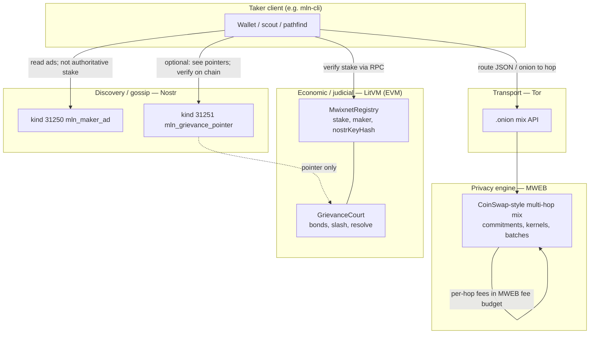
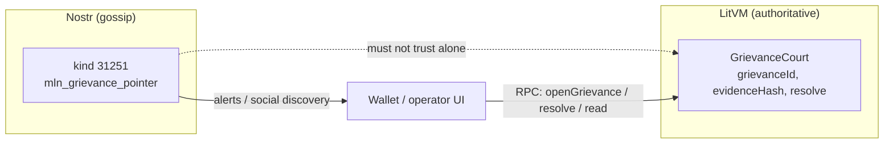
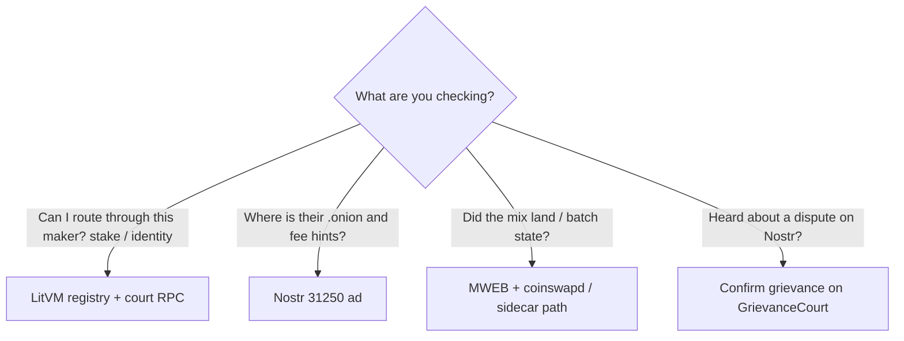

# MLN architecture: Nostr and LitVM

**Purpose:** Show how **Nostr** and **LitVM** fit next to **MWEB** (mixing) and **Tor** (transport).  
**Sources:** [`AGENTS.md`](../AGENTS.md) layer table, [`PRODUCT_SPEC.md`](../PRODUCT_SPEC.md) sections 3–6 and discovery notes, [`research/NOSTR_MLN.md`](../research/NOSTR_MLN.md) wire profile.

---

## How they weave in (short)

| Layer | Weaves in by… |
| ----- | ------------- |
| **LitVM** | **Authoritative stake and judicial state:** registry deposit, `registerMaker`, binding `nostrKeyHash`, exit cooldown, `GrievanceCourt` (open/resolve grievances, slash/bounty). Wallets **verify** stake and case state via **EVM RPC**, not by trusting Nostr. Happy-path mixes stay **off-chain / MWEB**; LitVM is **not** specified to re-verify every successful mix on-chain (too costly and metadata-heavy per product spec). |
| **Nostr** | **Discovery and gossip:** replaceable maker ads (kind **31250** `mln_maker_ad`) with Tor hints, fee hints, LitVM contract **pointers**, and optional `swapX25519PubHex` for onion handoff; kind **31251** `mln_grievance_pointer` as **signed pointers** to on-chain cases—clients **must confirm on LitVM**. Relays are untrusted transport; they see what you publish. |

**Binding:** [`research/NOSTR_MLN.md`](../research/NOSTR_MLN.md) defines `nostrKeyHash = keccak256(P)` for the maker’s x-only Nostr pubkey, stored on `MwixnetRegistry` so ads can be tied to an on-chain stake record.

---

## Diagram 1 — Layer stack (concerns)



*Per [`AGENTS.md`](../AGENTS.md): MWEB = mixing + default routing fees; LitVM = registry, bonds, slashing, grievances; Nostr = discovery and gossip (not authoritative for stake); Tor = transport.*

---

## Diagram 2 — Happy path: find makers, confirm stake, run mix

```mermaid
sequenceDiagram
  participant T as Taker (mln-cli / wallet)
  participant N as Nostr relays
  participant L as LitVM RPC
  participant Tor as Tor (.onion)
  participant CS as Makers + MWEB (coinswapd path)

  T->>N: Subscribe / query kind 31250 ads
  N-->>T: mln_maker_ad (Tor, LitVM pointers, optional swap key)
  T->>L: Read registry: stake, nostrKeyHash, freeze state
  L-->>T: On-chain truth for maker filter
  Note over T: Pathfind uses verified makers + ad metadata
  T->>Tor: Encrypted / onion payload to mix API
  Tor->>CS: Forward to maker stack
  CS-->>T: mweb_submitRoute / batch / status (implementation path)
  Note over CS: Aggregated MWEB tx; fees per PRODUCT_SPEC 5.2 baseline
```

*Ads are hints; stake checks are on LitVM per [`research/NOSTR_MLN.md`](../research/NOSTR_MLN.md) principles.*

---

## Diagram 3 — Grievance pointer vs on-chain case



*Kind 31251 is gossip only; verify cases on chain ([`research/NOSTR_MLN.md`](../research/NOSTR_MLN.md)).*

---

## Diagram 4 — Where truth lives (decision aid)



---

## Related docs

- [`PRODUCT_SPEC.md`](../PRODUCT_SPEC.md) — full product layers, economics, grievance model  
- [`research/NOSTR_MLN.md`](../research/NOSTR_MLN.md) — event schemas and `nostrKeyHash`  
- [`research/THREAT_MODEL_MLN.md`](../research/THREAT_MODEL_MLN.md) — discovery surveillance and trust boundaries
