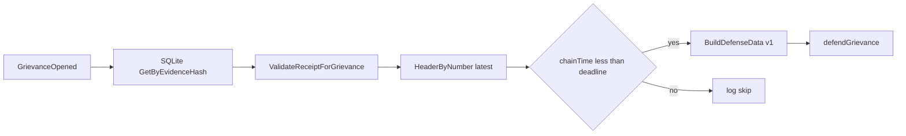

# mlnd — MLN operator daemon (LitVM + Nostr)

`mlnd` watches `GrievanceOpened` logs for your operator address, can load matching receipts from SQLite, optionally submits `defendGrievance` on LitVM, and (optionally) republishes **kind 31250** maker ads to Nostr relays.

## LitVM watcher (required)

| Env | Meaning |
|-----|---------|
| `MLND_WS_URL` | WebSocket JSON-RPC URL (default `ws://127.0.0.1:8545`) |
| `MLND_COURT_ADDR` | `GrievanceCourt` contract (hex) |
| `MLND_OPERATOR_ADDR` | Your maker / accused address (hex) |
| `MLND_DB_PATH` | SQLite path for evidence receipts (default `mlnd.db`) |

## LitVM testnet (documentation)

RPC URL, chain ID, block explorer, and faucet are published by the LitVM team. **Do not guess** production values: use the current endpoints from the official docs ([LitVM documentation](https://docs.litvm.com/); toolchain notes in [`research/LITVM.md`](../research/LITVM.md)).

Example **placeholders** (replace after you copy real values from docs):

```bash
export MLND_WS_URL="wss://REPLACE_WITH_OFFICIAL_LITVM_WS"
export MLND_COURT_ADDR="0xREPLACE_GRIEVANCE_COURT"
export MLND_OPERATOR_ADDR="0xYOUR_MAKER_ADDRESS"
# If using Nostr ads:
export MLND_LITVM_CHAIN_ID="REPLACE_DECIMAL_CHAIN_ID"
export MLND_REGISTRY_ADDR="0xREPLACE_REGISTRY"
```

Local Anvil keeps the default `MLND_WS_URL=ws://127.0.0.1:8545` from the table above.

## Auto-defend (optional, explicit opt-in)

**Security:** `MLND_OPERATOR_PRIVATE_KEY` is a **hot key** with gas-spend power. Use a dedicated key, minimal balance, and test with dry-run first. The derived address **must** match `MLND_OPERATOR_ADDR` (the contract checks `msg.sender == accused`).

| Env | Meaning |
|-----|---------|
| `MLND_DEFEND_AUTO` | Set to `1`, `true`, or `yes` to enable automatic `defendGrievance` after a receipt is found and validated |
| `MLND_OPERATOR_PRIVATE_KEY` | 64 hex chars (optional `0x`); required when `MLND_DEFEND_AUTO` is enabled |
| `MLND_DEFEND_DRY_RUN` | If `1`/`true`/`yes`, builds and logs defense calldata but **does not** broadcast a transaction |

If `MLND_DEFEND_AUTO` is unset/false, the daemon only validates receipts and logs (no transactions). If auto-defend is on but the vault has no receipt for the `evidenceHash`, you still get a critical log as before.

**Deadline check:** before sending, mlnd compares the latest chain head timestamp from `eth_getBlockByNumber(latest)` to the grievance `deadline` from the log (Unix seconds). It does **not** use the local wall clock for this guard.

**Retries:** up to three attempts with short backoff on likely transport errors; **not** on `execution reverted` / insufficient funds.

On-chain parsing of `defenseData` is still **TBD** (see `PRODUCT_SPEC.md` appendix 13.6); the contract currently accepts opaque calldata.

### Defense Data v1 format

`defenseData` is a single `abi.encode` of one Solidity tuple (opaque to `GrievanceCourt` today, decodable off-chain in one pass):

```solidity
tuple(
    uint8 version,              // must be 1
    uint256 epochId,
    address accuser,
    address accusedMaker,
    uint8 hopIndex,
    bytes32 peeledCommitment,
    bytes32 forwardCiphertextHash,
    bytes nextHopPubkeyUTF8,    // UTF-8 bytes of stored next-hop pubkey string
    bytes signatureUTF8         // UTF-8 bytes of stored signature string
)
```

Encoding is implemented in `internal/litvm/defense.go` (`BuildDefenseData`).

### Flow (auto-defend)



## Nostr broadcaster (optional)

Set **`MLND_NOSTR_RELAYS`** (comma-separated `wss://…` URLs) to enable. Also required:

| Env | Meaning |
|-----|---------|
| `MLND_NOSTR_NSEC` | Nostr secret: **nsec1…** bech32 or **64-char** hex (no `0x`) |
| `MLND_LITVM_CHAIN_ID` | Decimal chain id string (e.g. `31337`) |
| `MLND_REGISTRY_ADDR` | `MwixnetRegistry` (hex) |
| `MLND_COURT_ADDR` | Same as watcher |
| `MLND_OPERATOR_ADDR` | Same as watcher; used in NIP-33 `d` tag and must match on-chain maker registration |

Optional:

| Env | Meaning |
|-----|---------|
| `MLND_NOSTR_INTERVAL` | Republish interval (default `30m`; `time.ParseDuration` syntax) |
| `MLND_TOR_ONION` | Tor mix API URL for `content.tor` (include port in the URL, or set `MLND_TOR_PORT`) |
| `MLND_TOR_PORT` | If set and `MLND_TOR_ONION` has no port, the port is appended (e.g. `18081`) |
| `MLND_FEE_MIN_SAT` / `MLND_FEE_MAX_SAT` | If both set, adds `fees` object (`sat_per_hop`) |

Wire format: [`research/NOSTR_MLN.md`](../research/NOSTR_MLN.md). Relay smoke flow: [`research/E2E_NOSTR_DEMO.md`](../research/E2E_NOSTR_DEMO.md).

## coinswapd receipt bridge (optional)

When enabled, mlnd scans a directory for **`*.ndjson`** and **`*.jsonl`** files and appends each **complete line** to SQLite via `SaveReceipt`. Line format (LitVM identities + peel correlators + defense strings) is defined in [`PHASE_6_BRIDGE_INTEGRATION.md`](../PHASE_6_BRIDGE_INTEGRATION.md). Stock `coinswapd` does not emit this stream; a **fork or sidecar** must write lines there — see [`research/COINSWAPD_INTEGRATION.md`](../research/COINSWAPD_INTEGRATION.md) (section 7) and [`research/COINSWAPD_TEARDOWN.md`](../research/COINSWAPD_TEARDOWN.md).

| Env | Meaning |
|-----|---------|
| `MLND_BRIDGE_COINSWAPD` | Set to `1`, `true`, or `yes` to run the bridge |
| `MLND_BRIDGE_RECEIPTS_DIR` | **Required** when the bridge is enabled: directory to scan (non-recursive) |
| `MLND_BRIDGE_POLL_INTERVAL` | Optional scan period (default `2s`; `time.ParseDuration`, e.g. `5s`) |

Duplicate lines for the same `evidenceHash` are ignored (SQLite `ON CONFLICT DO NOTHING`).

**Run with a patched coinswapd**

1. Configure the fork to append one JSON object per line into files under a shared directory (e.g. `receipts.ndjson`).
2. Export `MLND_BRIDGE_COINSWAPD=1` and `MLND_BRIDGE_RECEIPTS_DIR` pointing at that directory; start `mlnd` with the usual LitVM variables.
3. Until the fork emits lines, the bridge only polls the directory; the watcher and Nostr paths are unchanged.

Phase history: [`PHASE_5_NOSTR_TOR_BRIDGE.md`](../PHASE_5_NOSTR_TOR_BRIDGE.md) (stub + wiring), [`PHASE_6_BRIDGE_INTEGRATION.md`](../PHASE_6_BRIDGE_INTEGRATION.md) (NDJSON ingestion), [`PHASE_7_END_TO_END.md`](../PHASE_7_END_TO_END.md) (coinswapd patch + `make test-operator-smoke`).

## Local operator smoke (Anvil, no coinswapd)

From the **repo root** with Anvil on `8545` (same as `make test-grievance`):

```bash
make test-operator-smoke
```

This runs [`scripts/mlnd-bridge-litvm-smoke.sh`](../scripts/mlnd-bridge-litvm-smoke.sh): deploys contracts, writes a **golden** NDJSON line matching [`EvidenceGoldenVectors.t.sol`](../contracts/test/EvidenceGoldenVectors.t.sol), starts mlnd with the bridge enabled (host **`go run`** when Go is 1.22+, otherwise **`docker run golang:1.22`** with `ws://host.docker.internal:8545`), opens `openGrievance` with the same `evidenceHash`, and checks that mlnd logs **validated receipt**. Requires `cast` or Docker Foundry for `cast`, and Docker if your host Go is below 1.22.

`make test-full-stack` is **unchanged** (grievance + Nostr pointer echo only); see [`PHASE_7_END_TO_END.md`](../PHASE_7_END_TO_END.md).

**Dependency note:** imports use module path `github.com/nbd-wtf/go-nostr` with a `replace` to **`github.com/fiatjaf/go-nostr`** (maintained fork). Version is pinned to **v0.35.0** for Go **1.22** CI compatibility.

## Build / test

```bash
cd mlnd
go test ./... -count=1
```

Evidence hash and `grievanceId` helpers match `contracts/src/EvidenceLib.sol`; see [`research/EVIDENCE_GENERATOR.md`](../research/EVIDENCE_GENERATOR.md).
