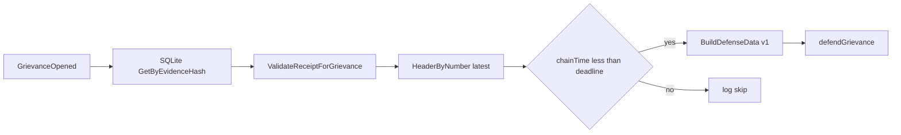

# mlnd — MLN operator daemon (LitVM + Nostr)

`mlnd` watches `GrievanceOpened` logs for your operator address, can load matching receipts from SQLite, optionally submits `defendGrievance` on LitVM, and (optionally) republishes **kind 31250** maker ads to Nostr relays.

**Step-by-step: local Anvil, env vars, browser URL, troubleshooting:** [`MAKER_DASHBOARD_SETUP.md`](MAKER_DASHBOARD_SETUP.md)

**Registry stake + `registerMaker`:** `mlnd` does not send those txs; use **`mln-cli maker onboard`** (dry-run by default, `-execute` to broadcast). See [`PHASE_10_TAKER_CLI.md`](../PHASE_10_TAKER_CLI.md) Phase 10.4.

## LitVM watcher (required)

| Env | Meaning |
|-----|---------|
| `MLND_WS_URL` | WebSocket JSON-RPC URL (default `ws://127.0.0.1:8545`) |
| `MLND_COURT_ADDR` | `GrievanceCourt` contract (hex) |
| `MLND_OPERATOR_ADDR` | Your maker / accused address (hex) |
| `MLND_DB_PATH` | SQLite path for evidence receipts (default `mlnd.db`) |

## LitVM testnet (documentation)

RPC URL, chain ID, block explorer, and faucet are published by the LitVM team. **Do not guess** production values: use the current endpoints from the official docs ([LitVM documentation](https://docs.litvm.com/); toolchain notes in [`research/LITVM.md`](../research/LITVM.md)).

Example **placeholders** (replace after you copy real values from docs):

```bash
export MLND_WS_URL="wss://REPLACE_WITH_OFFICIAL_LITVM_WS"
export MLND_COURT_ADDR="0xREPLACE_GRIEVANCE_COURT"
export MLND_OPERATOR_ADDR="0xYOUR_MAKER_ADDRESS"
# If using Nostr ads:
export MLND_LITVM_CHAIN_ID="REPLACE_DECIMAL_CHAIN_ID"
export MLND_REGISTRY_ADDR="0xREPLACE_REGISTRY"
```

Local Anvil keeps the default `MLND_WS_URL=ws://127.0.0.1:8545` from the table above.

### Run on LitVM testnet

1. Copy [`mlnd/.env.example`](.env.example) to `mlnd/.env` (or export variables in your shell). Fill **only** from [official LitVM docs](https://docs.litvm.com/) and [`research/LITVM.md`](../research/LITVM.md); do not commit secrets.
2. `mlnd` needs **`MLND_WS_URL`** (WebSocket). For `cast`-based checks (`make testnet-smoke`), set **`MLND_HTTP_URL`** to the HTTP JSON-RPC endpoint LitVM documents for tooling (often a different URL than WS).
3. Start the daemon from `mlnd/` with `go run ./cmd/mlnd` or use a release binary / Docker (below).

### Docker Compose (operators)

For a full operator layout (volumes for SQLite + receipt dir, `env_file`), use the root [`docker-compose.yml`](../docker-compose.yml) and [`.env.compose.example`](../.env.compose.example). Runbook: [`PHASE_9_ENABLEMENT.md`](../PHASE_9_ENABLEMENT.md).

### Docker image

From the **repo root**:

```bash
make docker-build
# example: persist SQLite + mount receipt dir for the coinswapd bridge
docker run --rm -e MLND_WS_URL -e MLND_COURT_ADDR -e MLND_OPERATOR_ADDR \
  -v "$PWD/mlnd-data:/data" -e MLND_DB_PATH=/data/mlnd.db \
  mlnd:local
```

Build context is this directory; see [`Dockerfile`](Dockerfile) (multi-stage `golang:1.22-bookworm` → `debian:bookworm-slim`, `CGO_ENABLED=1`).

### Testnet RPC smoke (optional)

With real testnet values:

```bash
export MLND_HTTP_URL="https://…"   # HTTP JSON-RPC for cast
export MLND_COURT_ADDR="0x…"
make testnet-smoke
```

If `cast` is not on your PATH, the script uses Docker Foundry; for **local** Anvil on `127.0.0.1`, it rewrites the URL to `host.docker.internal` so the container can reach the host (same idea as `scripts/deploy-local-anvil.sh`).

## Auto-defend (optional, explicit opt-in)

**Security:** `MLND_OPERATOR_PRIVATE_KEY` is a **hot key** with gas-spend power. Use a dedicated key, minimal balance, and test with dry-run first. The derived address **must** match `MLND_OPERATOR_ADDR` (the contract checks `msg.sender == accused`).

| Env | Meaning |
|-----|---------|
| `MLND_DEFEND_AUTO` | Set to `1`, `true`, or `yes` to enable automatic `defendGrievance` after a receipt is found and validated |
| `MLND_OPERATOR_PRIVATE_KEY` | 64 hex chars (optional `0x`); required when `MLND_DEFEND_AUTO` is enabled |
| `MLND_DEFEND_DRY_RUN` | If `1`/`true`/`yes`, builds and logs defense calldata but **does not** broadcast a transaction |

If `MLND_DEFEND_AUTO` is unset/false, the daemon only validates receipts and logs (no transactions). If auto-defend is on but the vault has no receipt for the `evidenceHash`, you still get a critical log as before.

**Deadline check:** before sending, mlnd compares the latest chain head timestamp from `eth_getBlockByNumber(latest)` to the grievance `deadline` from the log (Unix seconds). It does **not** use the local wall clock for this guard.

**Retries:** up to three attempts with short backoff on likely transport errors; **not** on `execution reverted` / insufficient funds.

On-chain parsing of `defenseData` is still **TBD** (see `PRODUCT_SPEC.md` appendix 13.6); the contract currently accepts opaque calldata.

### Defense Data v1 format

`defenseData` is a single `abi.encode` of one Solidity tuple (opaque to `GrievanceCourt` today, decodable off-chain in one pass):

```solidity
tuple(
    uint8 version,              // must be 1
    uint256 epochId,
    address accuser,
    address accusedMaker,
    uint8 hopIndex,
    bytes32 peeledCommitment,
    bytes32 forwardCiphertextHash,
    bytes nextHopPubkeyUTF8,    // UTF-8 bytes of stored next-hop pubkey string
    bytes signatureUTF8         // UTF-8 bytes of stored signature string
)
```

Encoding is implemented in `internal/litvm/defense.go` (`BuildDefenseData`).

### Flow (auto-defend)



## Nostr broadcaster (optional)

Set **`MLND_NOSTR_RELAYS`** (comma-separated `wss://…` URLs) so the process can use those relays (dashboard self-check always; see below). To **publish** replaceable maker ads, also set the signing key and related vars:

| Env | Meaning |
|-----|---------|
| `MLND_NOSTR_NSEC` | Nostr secret: **nsec1…** bech32 or **64-char** hex (no `0x`). If relays are set but this is **empty**, the broadcaster does not run; the dashboard may still query relays. |
| `MLND_LITVM_CHAIN_ID` | Decimal chain id string (e.g. `31337`) |
| `MLND_REGISTRY_ADDR` | `MwixnetRegistry` (hex) |
| `MLND_COURT_ADDR` | Same as watcher |
| `MLND_OPERATOR_ADDR` | Same as watcher; used in NIP-33 `d` tag and must match on-chain maker registration |

Optional:

| Env | Meaning |
|-----|---------|
| `MLND_NOSTR_INTERVAL` | Republish interval (default `30m`; `time.ParseDuration` syntax) |
| `MLND_TOR_ONION` | Tor mix API URL for `content.tor` (include port in the URL, or set `MLND_TOR_PORT`) |
| `MLND_TOR_PORT` | If set and `MLND_TOR_ONION` has no port, the port is appended (e.g. `18081`) |
| `MLND_FEE_MIN_SAT` / `MLND_FEE_MAX_SAT` | If both set, adds `fees` object (`sat_per_hop`) |
| `MLND_SWAP_X25519_PUB_HEX` | Optional **64** lowercase hex digits (32-byte Curve25519 pubkey) for `content.swapX25519PubHex` in the maker ad (see [`research/COINSWAPD_MLN_FORK_SPEC.md`](../research/COINSWAPD_MLN_FORK_SPEC.md)) |

Wire format: [`research/NOSTR_MLN.md`](../research/NOSTR_MLN.md). Relay smoke flow: [`research/E2E_NOSTR_DEMO.md`](../research/E2E_NOSTR_DEMO.md).

## Maker dashboard HTTP (optional)

Full setup guide (Anvil, addresses, paste pitfalls): [`MAKER_DASHBOARD_SETUP.md`](MAKER_DASHBOARD_SETUP.md).

Loopback **control center** for operators: LitVM registry/court views, Nostr ad self-check (kind **31250**), receipt-vault stats, live grievance/defense milestones (SSE). Does **not** hold or accept operator private keys; it is read-only for chain writes.

| Env | Meaning |
|-----|---------|
| `MLND_DASHBOARD_ADDR` | If set (e.g. `127.0.0.1:9842`), serves UI + JSON API on that **host:port** |
| `MLND_REGISTRY_ADDR` | **Required** when the dashboard is enabled (same registry as Nostr ad) |
| `MLND_HTTP_TOKEN` | Optional shared secret: header `X-MLND-Token`, `Authorization: Bearer …`, or query `?token=` (needed for EventSource) |
| `MLND_DASHBOARD_ALLOW_LAN` | Set to `1`/`true`/`yes` to allow non-loopback bind hosts (default: loopback only) |

Endpoints: `GET /` (static UI), `GET /api/v1/status` (JSON), `GET /api/v1/events` (SSE, prior milestones replayed then live). Uses the same `MLND_WS_URL` client as the watcher for `eth_call` views.

**zsh paste trap:** If `interactivecomments` is off (common default), text after `#` on the **same line** as `export` is **not** ignored. The shell then tries to parse words like `d-tag` and fails with `export: not valid in this context: d-tag`. Use **only** the lines below (no trailing comments), or run `setopt interactivecomments`, or put comments on the line above.

**Paste each `export` on its own line** (a single long line like `export A=1export B=2` breaks variables). Replace the three `0x…` addresses with real deployed contract / maker addresses from your LitVM setup; `mlnd` rejects the zero address, invalid hex, and literal `YOUR` placeholders.

Minimal example (run from **repo root** so `make build` produces `bin/mlnd`):

```bash
export MLND_WS_URL=ws://127.0.0.1:8545
export MLND_COURT_ADDR=0xabcdef0123456789abcdef0123456789abcdef01
export MLND_OPERATOR_ADDR=0x1234567890123456789012345678901234567890
export MLND_REGISTRY_ADDR=0xfedcba0987654321fedcba0987654321fedcba09
export MLND_LITVM_CHAIN_ID=31337
export MLND_NOSTR_RELAYS=wss://your.relay.example
export MLND_DASHBOARD_ADDR=127.0.0.1:9842
make build
./bin/mlnd
```

Open `http://127.0.0.1:9842/`. If you set `MLND_HTTP_TOKEN`, open `http://127.0.0.1:9842/?token=YOUR_TOKEN` so the UI can call the API and EventSource.

You can set `MLND_NOSTR_RELAYS` **without** `MLND_NOSTR_NSEC` for dashboard-only use: mlnd logs that the broadcaster is disabled but still uses those relays for read-only maker-ad self-check. Add `MLND_NOSTR_NSEC` when you want to publish kind **31250** ads.

## coinswapd receipt bridge (optional)

When enabled, mlnd scans a directory for **`*.ndjson`** and **`*.jsonl`** files and appends each **complete line** to SQLite via `SaveReceipt`. Line format (LitVM identities + peel correlators + defense strings) is defined in [`PHASE_6_BRIDGE_INTEGRATION.md`](../PHASE_6_BRIDGE_INTEGRATION.md). Stock `coinswapd` does not emit this stream; a **fork or sidecar** must write lines there — see [`research/COINSWAPD_INTEGRATION.md`](../research/COINSWAPD_INTEGRATION.md) (section 7) and [`research/COINSWAPD_TEARDOWN.md`](../research/COINSWAPD_TEARDOWN.md).

| Env | Meaning |
|-----|---------|
| `MLND_BRIDGE_COINSWAPD` | Set to `1`, `true`, or `yes` to run the bridge |
| `MLND_BRIDGE_RECEIPTS_DIR` | **Required** when the bridge is enabled: directory to scan (non-recursive) |
| `MLND_BRIDGE_POLL_INTERVAL` | Optional scan period (default `2s`; `time.ParseDuration`, e.g. `5s`) |

Duplicate lines for the same `evidenceHash` are ignored (SQLite `ON CONFLICT DO NOTHING`).

**Run with a patched coinswapd**

1. Configure the fork to append one JSON object per line into files under a shared directory (e.g. `receipts.ndjson`).
2. Export `MLND_BRIDGE_COINSWAPD=1` and `MLND_BRIDGE_RECEIPTS_DIR` pointing at that directory; start `mlnd` with the usual LitVM variables.
3. Until the fork emits lines, the bridge only polls the directory; the watcher and Nostr paths are unchanged.

Phase history: [`PHASE_5_NOSTR_TOR_BRIDGE.md`](../PHASE_5_NOSTR_TOR_BRIDGE.md) (stub + wiring), [`PHASE_6_BRIDGE_INTEGRATION.md`](../PHASE_6_BRIDGE_INTEGRATION.md) (NDJSON ingestion), [`PHASE_7_END_TO_END.md`](../PHASE_7_END_TO_END.md) (coinswapd patch + `make test-operator-smoke`), [`PHASE_8_TESTNET_RELEASE.md`](../PHASE_8_TESTNET_RELEASE.md) (Docker, releases, `.env.example`, `make testnet-smoke`).

## Local operator smoke (Anvil, no coinswapd)

From the **repo root** with Anvil on `8545` (same as `make test-grievance`):

```bash
make test-operator-smoke
```

This runs [`scripts/mlnd-bridge-litvm-smoke.sh`](../scripts/mlnd-bridge-litvm-smoke.sh): deploys contracts, writes a **golden** NDJSON line matching [`EvidenceGoldenVectors.t.sol`](../contracts/test/EvidenceGoldenVectors.t.sol), starts mlnd with the bridge enabled (host **`go run`** when Go is 1.22+, otherwise **`docker run golang:1.22`** with `ws://host.docker.internal:8545`), opens `openGrievance` with the same `evidenceHash`, and checks that mlnd logs **validated receipt**. Requires `cast` or Docker Foundry for `cast`, and Docker if your host Go is below 1.22.

`make test-full-stack` is **unchanged** (grievance + Nostr pointer echo only); see [`PHASE_7_END_TO_END.md`](../PHASE_7_END_TO_END.md).

**Dependency note:** imports use module path `github.com/nbd-wtf/go-nostr` with a `replace` to **`github.com/fiatjaf/go-nostr`** (maintained fork). Version is pinned to **v0.35.0** for Go **1.22** CI compatibility.

## Build / test

From **repo root** (writes `bin/mlnd`, needs **Go 1.22+**, CGO, and a C toolchain on the host):

```bash
make build
# Run with MLND_* env vars set (see tables above), e.g. from mlnd/: ../bin/mlnd
```

Unit tests:

```bash
cd mlnd
go test ./... -count=1
```

Evidence hash and `grievanceId` helpers match `contracts/src/EvidenceLib.sol`; see [`research/EVIDENCE_GENERATOR.md`](../research/EVIDENCE_GENERATOR.md).
