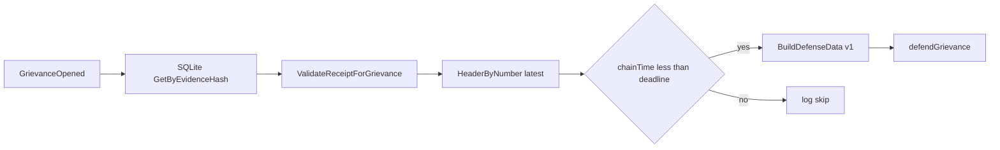

# mlnd — MLN operator daemon (LitVM + Nostr)

`mlnd` watches `GrievanceOpened` logs for your operator address, can load matching receipts from SQLite, optionally submits `defendGrievance` on LitVM, and (optionally) republishes **kind 31250** maker ads to Nostr relays.

## LitVM watcher (required)

| Env | Meaning |
|-----|---------|
| `MLND_WS_URL` | WebSocket JSON-RPC URL (default `ws://127.0.0.1:8545`) |
| `MLND_COURT_ADDR` | `GrievanceCourt` contract (hex) |
| `MLND_OPERATOR_ADDR` | Your maker / accused address (hex) |
| `MLND_DB_PATH` | SQLite path for evidence receipts (default `mlnd.db`) |

## Auto-defend (optional, explicit opt-in)

**Security:** `MLND_OPERATOR_PRIVATE_KEY` is a **hot key** with gas-spend power. Use a dedicated key, minimal balance, and test with dry-run first. The derived address **must** match `MLND_OPERATOR_ADDR` (the contract checks `msg.sender == accused`).

| Env | Meaning |
|-----|---------|
| `MLND_DEFEND_AUTO` | Set to `1`, `true`, or `yes` to enable automatic `defendGrievance` after a receipt is found and validated |
| `MLND_OPERATOR_PRIVATE_KEY` | 64 hex chars (optional `0x`); required when `MLND_DEFEND_AUTO` is enabled |
| `MLND_DEFEND_DRY_RUN` | If `1`/`true`/`yes`, builds and logs defense calldata but **does not** broadcast a transaction |

If `MLND_DEFEND_AUTO` is unset/false, the daemon only validates receipts and logs (no transactions). If auto-defend is on but the vault has no receipt for the `evidenceHash`, you still get a critical log as before.

**Deadline check:** before sending, mlnd compares the latest chain head timestamp from `eth_getBlockByNumber(latest)` to the grievance `deadline` from the log (Unix seconds). It does **not** use the local wall clock for this guard.

**Retries:** up to three attempts with short backoff on likely transport errors; **not** on `execution reverted` / insufficient funds.

On-chain parsing of `defenseData` is still **TBD** (see `PRODUCT_SPEC.md` appendix 13.6); the contract currently accepts opaque calldata.

### Defense Data v1 format

`defenseData` is a single `abi.encode` of one Solidity tuple (opaque to `GrievanceCourt` today, decodable off-chain in one pass):

```solidity
tuple(
    uint8 version,              // must be 1
    uint256 epochId,
    address accuser,
    address accusedMaker,
    uint8 hopIndex,
    bytes32 peeledCommitment,
    bytes32 forwardCiphertextHash,
    bytes nextHopPubkeyUTF8,    // UTF-8 bytes of stored next-hop pubkey string
    bytes signatureUTF8         // UTF-8 bytes of stored signature string
)
```

Encoding is implemented in `internal/litvm/defense.go` (`BuildDefenseData`).

### Flow (auto-defend)



## Nostr broadcaster (optional)

Set **`MLND_NOSTR_RELAYS`** (comma-separated `wss://…` URLs) to enable. Also required:

| Env | Meaning |
|-----|---------|
| `MLND_NOSTR_NSEC` | Nostr secret: **nsec1…** bech32 or **64-char** hex (no `0x`) |
| `MLND_LITVM_CHAIN_ID` | Decimal chain id string (e.g. `31337`) |
| `MLND_REGISTRY_ADDR` | `MwixnetRegistry` (hex) |
| `MLND_COURT_ADDR` | Same as watcher |
| `MLND_OPERATOR_ADDR` | Same as watcher; used in NIP-33 `d` tag and must match on-chain maker registration |

Optional:

| Env | Meaning |
|-----|---------|
| `MLND_NOSTR_INTERVAL` | Republish interval (default `30m`; `time.ParseDuration` syntax) |
| `MLND_TOR_ONION` | Tor mix API URL for `content.tor` (include port in the URL, or set `MLND_TOR_PORT`) |
| `MLND_TOR_PORT` | If set and `MLND_TOR_ONION` has no port, the port is appended (e.g. `18081`) |
| `MLND_FEE_MIN_SAT` / `MLND_FEE_MAX_SAT` | If both set, adds `fees` object (`sat_per_hop`) |

Wire format: [`research/NOSTR_MLN.md`](../research/NOSTR_MLN.md). Relay smoke flow: [`research/E2E_NOSTR_DEMO.md`](../research/E2E_NOSTR_DEMO.md).

## coinswapd receipt bridge (optional stub)

| Env | Meaning |
|-----|---------|
| `MLND_BRIDGE_COINSWAPD` | Set to `1`, `true`, or `yes` to run the v0 bridge goroutine (logs only; no `SaveReceipt` yet). Future versions will follow [`research/COINSWAPD_TEARDOWN.md`](../research/COINSWAPD_TEARDOWN.md) JSON-RPC (`swap_*`) or log tailing. |

See [`PHASE_5_NOSTR_TOR_BRIDGE.md`](../PHASE_5_NOSTR_TOR_BRIDGE.md) for the full Phase 5 scope.

**Dependency note:** imports use module path `github.com/nbd-wtf/go-nostr` with a `replace` to **`github.com/fiatjaf/go-nostr`** (maintained fork). Version is pinned to **v0.35.0** for Go **1.22** CI compatibility.

## Build / test

```bash
cd mlnd
go test ./... -count=1
```

Evidence hash and `grievanceId` helpers match `contracts/src/EvidenceLib.sol`; see [`research/EVIDENCE_GENERATOR.md`](../research/EVIDENCE_GENERATOR.md).
