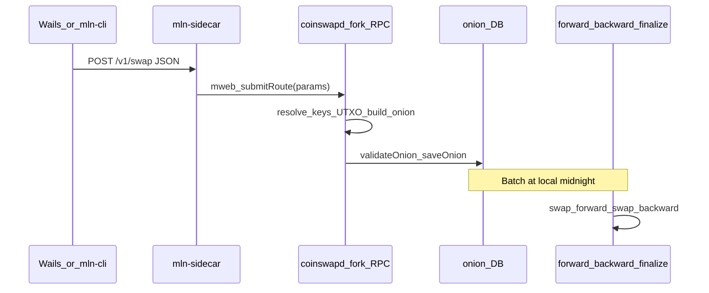

# Blueprint: `ltcmweb/coinswapd` MLN fork (`mweb_*` JSON-RPC)

**Status:** normative integration spec for work in a **fork** of [ltcmweb/coinswapd](https://github.com/ltcmweb/coinswapd) (in-repo tree [`research/coinswapd/`](coinswapd/)). **Consumer of this contract** in this repo: [`mln-sidecar`](../mln-sidecar/README.md) `-mode=rpc`.

**Related:** [COINSWAPD_TEARDOWN.md](COINSWAPD_TEARDOWN.md) (upstream entry points, `onion.Onion`, `swap_Swap`), [PHASE_10_TAKER_CLI.md](../PHASE_10_TAKER_CLI.md), [EVIDENCE_GENERATOR.md](EVIDENCE_GENERATOR.md) (`swap_forward` byte semantics for LitVM).

---

## 1. Goals and non-goals

**Goals**

- Expose **`mweb_getBalance`** and **`mweb_submitRoute`** on the same process (or colocated proxy) that runs the MWEB swap engine, so [`mln-sidecar`](../mln-sidecar/internal/mweb/rpc_bridge.go) can forward taker traffic without building onions in the sidecar.
- Accept the **MLN route JSON** shape already produced by [`mln-cli`](../mln-cli/internal/forger/client.go) and validated by [`mln-sidecar`](../mln-sidecar/internal/mweb/translator.go).
- Translate that payload into a **`onion.Onion`**, then persist via the same path as **`swap_Swap`** (`validateOnion` → `saveOnion` in upstream terms).

**Non-goals**

- LitVM registry RPC, Nostr, or Tor **inside** this RPC handler (except **binding** hop identities to keys—see §3).
- Changing **`swap_forward` / `swap_backward`** framing, gob layout, or XOR ciphertext semantics (would require a spec bump and [`EVIDENCE_GENERATOR.md`](EVIDENCE_GENERATOR.md) / [`PRODUCT_SPEC.md`](../PRODUCT_SPEC.md) updates).

---

## 2. Wire contract (normative)

### 2.1 Transport

- **JSON-RPC 2.0** over HTTP POST, same stack as upstream: [`go-ethereum/rpc`](https://pkg.go.dev/github.com/ethereum/go-ethereum/rpc).
- Upstream registers `swap` → methods **`swap_Swap`**, etc. This fork MUST register an additional namespace, e.g. **`mweb`**, so methods appear as **`mweb_submitRoute`** and **`mweb_getBalance`** (top-level method names as seen by `rpc.Client.Call`, consistent with [`rpc_bridge.go`](../mln-sidecar/internal/mweb/rpc_bridge.go)).

### 2.2 `mweb_getBalance`

- **Params:** none.
- **Result** (JSON object):

| Field | Type | Required | Description |
| ----- | ---- | -------- | ----------- |
| `availableSat` | number (uint64) | yes | Total MWEB balance in satoshis the wallet can see (fork defines “available” vs dust). |
| `spendableSat` | number (uint64) | yes | Balance usable for a new swap after internal reserves / locks. |
| `detail` | string | no | Human-readable diagnostic (e.g. “syncing”). |

Semantics align with [PHASE_10_TAKER_CLI.md](../PHASE_10_TAKER_CLI.md) and sidecar `GET /v1/balance`.

### 2.3 `mweb_submitRoute`

- **Params:** a **single** JSON object (the MLN extension body).
- **Result:** `null` or a small object (e.g. `{ "accepted": true }`). Clients in this repo **ignore** the result on success; failures MUST use JSON-RPC error responses so the sidecar surfaces **502** to the wallet.

#### Payload shape (same as `mln-cli` / sidecar)

| Field | Type | Required | Description |
| ----- | ---- | -------- | ----------- |
| `route` | array of hop objects | yes | Length **3** (current MLN PoC); see below. |
| `destination` | string | yes | MWEB destination encoding for the taker output (fork parses to `wire.MwebOutput` for last hop). On **Litecoin mainnet**, ltcmweb/ltcd uses Bech32 HRP **`ltcmweb`** (addresses start with **`ltcmweb1`**), not `mweb1`. |
| `amount` | number (uint64) | yes | Route value budget in satoshis; **sum of hop `feeMinSat` must not exceed `amount`** (matches sidecar validation). |

**Hop object**

| Field | Type | Required | Description |
| ----- | ---- | -------- | ----------- |
| `tor` | string | yes | Tor or mix API URL for the hop (operator advertising). Consumers (`mln-sidecar`, `mln-cli` forger) may prepend **`http://`** when the string has no URI scheme so **`rpc.Dial`** accepts it; ads should still send a full URL when possible. |
| `feeMinSat` | number (uint64) | yes | Per-hop fee hint; maps to `Hop.Fee` in `onion` layers. |
| `swapX25519PubHex` | string | no | **Approach A:** 64 lowercase hex digits = 32-byte Curve25519 public key for this maker’s swap/onion layer. See §3. |

#### Golden example

```json
{
  "route": [
    {
      "tor": "http://n1.onion:8080",
      "feeMinSat": 1000,
      "swapX25519PubHex": "0123456789abcdef0123456789abcdef0123456789abcdef0123456789abcdef"
    },
    {
      "tor": "http://n2.onion:8080",
      "feeMinSat": 1000,
      "swapX25519PubHex": "fedcba9876543210fedcba9876543210fedcba9876543210fedcba9876543210"
    },
    {
      "tor": "http://n3.onion:8080",
      "feeMinSat": 1000,
      "swapX25519PubHex": "aaaaaaaaaaaaaaaaaaaaaaaaaaaaaaaaaaaaaaaaaaaaaaaaaaaaaaaaaaaaaaaa"
    }
  ],
  "destination": "ltcmweb1qq...",
  "amount": 5000000
}
```

*(The `destination` line abbreviates with `...`; real payloads use the full Bech32 string from the wallet, starting with `ltcmweb1` on Litecoin mainnet per ltcmweb/ltcd.)*

### 2.4 Validation parity with `mln-sidecar`

Today [`ValidateSwapRequest`](../mln-sidecar/internal/mweb/translator.go) requires:

- Exactly **3** hops.
- Non-empty `destination`, `amount > 0`.
- Each `tor` non-empty.
- `sum(feeMinSat) ≤ amount` (with overflow-safe addition).

**Additional rule (swap keys):** If **any** hop includes `swapX25519PubHex`, then **every** hop MUST include a valid key: exactly **64** characters, `[0-9a-f]`. If **no** hop includes the field (or all empty), the payload is still valid for **mock / legacy** flows; the **fork** SHOULD reject real onion construction until keys are present (see §3).

### 2.5 Ports and operators

- Upstream `coinswapd` listens on **`-l`**, default **8080**.
- `mln-sidecar` defaults **`-rpc-url http://127.0.0.1:8546`**.

Operators MUST align listen port and sidecar URL. Document in runbooks: either run the fork on **8546** or pass **`-rpc-url http://127.0.0.1:8080`** (or Tor proxy URL) to the sidecar.

---

## 3. Key material and maker binding

The minimal MLN POST originally carried only **`tor`** + **`feeMinSat`**. Layered onion encryption requires a **static X25519 (or equivalent) public key per maker** known to the taker when building `enc_payloads` (see teardown: `onion/onion.go`, ChaCha + ECDH).

| Approach | Description | Use |
| -------- | ----------- | --- |
| **A. Extend MLN JSON** | Makers advertise **`swapX25519PubHex`** in Nostr `mln_maker_ad` content; scout copies it into the route; forger POSTs it. | **Production target** (implemented in this repo wire). |
| **B. Resolver in fork** | Fork dials Tor/HTTPS to each maker and fetches a key document. | Optional; higher operational complexity. |
| **C. Config map** | Local file: Tor URL → pubkey. | **Milestone 1** fork development and CI. |

**Recommendation:** Implement **C** first to unblock `mweb_submitRoute` ↔ `onion.Onion` plumbing; require **A** for public networks. **B** only if you need key rotation without republishing Nostr ads.

---

## 4. Data flow



---

## 5. Implementation map (inside the fork)

Read order (matches [COINSWAPD_TEARDOWN.md](COINSWAPD_TEARDOWN.md)):

1. **`onion/onion.go`** — `Onion`, `Hop`, `New` / `Peel`, owner proof, JSON tags.
2. **`main.go`** — `swapService.Swap`, `validateOnion`, DB persistence.
3. **`swap.go`** — `peelOnions`, `forward`, `backward`, `finalize`.

### 5.1 `mweb_submitRoute` algorithm (checklist)

1. **Parse** JSON into the struct matching §2.3 (including optional `swapX25519PubHex`).
2. **Validate** structural and fee rules (§2.4); apply fork policy on required keys for non-mock deployments.
3. **Resolve keys** — from payload (A), config map (C), or resolver (B).
4. **Map route order** to the fork’s notion of ordered makers / nodes. Upstream uses a **midnight `getNodes` list**; MLN supplies a **dynamic 3-hop path**. The fork must define whether route hops are **ephemeral RPC targets** only, or whether they are merged into local node state for `forward` (likely **Tor URL → RPC client** for `swap_forward` to each next hop as today).
5. **UTXO selection** — choose MWEB inputs from the wallet / `MwebCoinDB` consistent with `validateOnion` (commitments, `FetchCoin`, signatures).
6. **Destination** — parse `destination` into the **last hop’s** `Hop.Output` (`*wire.MwebOutput`) with valid range proof and output signature (teardown §8.1).
7. **Fees** — set each peeled hop’s `Hop.Fee` from `feeMinSat` such that aggregated fees satisfy `swap.go`’s **`insufficient hop fees`** check ([teardown fee snippet](COINSWAPD_TEARDOWN.md)).
8. **Build onion** — produce `enc_payloads`, per-layer `ephemeral_xpub`, `owner_proof`, and input fields so `validateOnion` succeeds.
9. **Handoff** — call the **same mutex + DB path** as `Swap`: validate then `saveOnion` (refactor internal helper if needed to avoid duplicating locking).

### 5.2 `mweb_getBalance`

Expose wallet/MWEB coin state consistent with what `validateOnion` uses, returning `availableSat` / `spendableSat` (+ optional `detail`).

### 5.3 Cryptography boundary

Pedersen commitments, Bulletproofs, `wire.MwebOutput` / kernel assembly live under **`ltcmweb/ltcd`** (`ltcutil/mweb`, etc.), not a separate `mwebd` import in `coinswapd` (see teardown).

### 5.4 MLN local taker (`-mln-local-taker`)

Default startup calls **`getNodes()`** / **`config.AliveNodes`**: the process’s **`-k`** X25519 public key must match one of the [hardcoded mesh rows](coinswapd/config/nodes.go) (or the probe fails). That is wrong for **MLN `mweb_*`** smoke, where **`-k`** is usually random and **peers** come only from **`mweb_submitRoute`**. The fork flag **`-mln-local-taker`** skips that probe, sets **node index 0**, and skips the hourly **`getNodes()`** refresh — use for local E2E and taker-only JSON-RPC; **omit** when running as a registered public mesh operator.

---

## 6. Type mapping (MLN JSON → `onion.Onion`)

| MLN source | Target (conceptual) |
| ---------- | ------------------- |
| `amount`, selected UTXOs | `input.*` fields on `onion.Onion` (output id, commit, keys, sig) |
| `destination` | Last hop `Hop.Output` after peel |
| `route[i].feeMinSat` | `Hop.Fee` for layer *i* (after ordering convention is fixed in fork) |
| `route[i].swapX25519PubHex` | ECDH peer material for encrypting layer *i* payloads |
| `route[i].tor` | Out-of-band RPC dial target for **`swap_forward`** / operator, not a field inside the onion JSON |

Exact field-level mapping MUST be verified against **`onion.Onion` JSON** in the fork and frozen in a future revision once the fork’s builder is implemented.

---

## 7. Error catalog (JSON-RPC)

Implementers SHOULD use:

| Condition | Suggested code | Message hint |
| --------- | -------------- | ------------ |
| Malformed JSON / wrong types | `-32700` / `-32602` | Parse / invalid params |
| Validation (hop count, fees, missing tor) | `-32602` | Mirror sidecar errors |
| Missing or invalid `swapX25519PubHex` when required | `-32602` | `swap keys required` |
| Insufficient funds / no UTXO | Custom (e.g. `-32000`) | `insufficient funds` |
| Crypto / `validateOnion` failure | Custom (e.g. `-32000`) | Preserve inner error text for logs, sanitize for clients if needed |
| Internal / DB | `-32603` | `internal error` |

---

## 8. Test plan

1. **Unit** — Same cases as [`translator_test.go`](../mln-sidecar/internal/mweb/translator.go) (hops, fees, optional keys).
2. **Integration** — Run fork + `mln-sidecar -mode=rpc`; `mln-cli` or `curl` POST `/v1/swap` with golden JSON (§2.3).
3. **Engine** — After onion is saved, exercise midnight **`forward` → `backward` → `finalize`** in a controlled clock or test hook if upstream allows.
4. **Regression** — Ensure existing **`swap_Swap(onion.Onion)`** still works for callers that build onions offline.

---

## 9. Milestones

| Milestone | Deliverable |
| --------- | ----------- |
| **M0** | RPC server registers `mweb_*`; stub methods return errors or null. |
| **M1** | `mweb_getBalance` returns real balances from wallet state. |
| **M2** | `mweb_submitRoute` builds a valid `onion.Onion` using **config map (C)** keys + local UTXOs; persists; one integration test. |
| **M3** | **Approach A** keys from Nostr propagated through this repo’s stack; fork requires keys on testnet/mainnet profiles. |
| **M4** | Operator docs: port matrix, sidecar flags, LitVM vs MWEB process layout. |

---

## 10. Self-included routing

[PHASE_14_SELF_INCLUSION.md](../PHASE_14_SELF_INCLUSION.md): fixing N2 to the local maker is a **wallet/pathfind** concern. After the onion enters **`swap_Swap`**, middle-hop behavior remains **`swap_forward`** on `mlnd` / `coinswapd`. No change to **`mln-sidecar`** for Phase 14.
