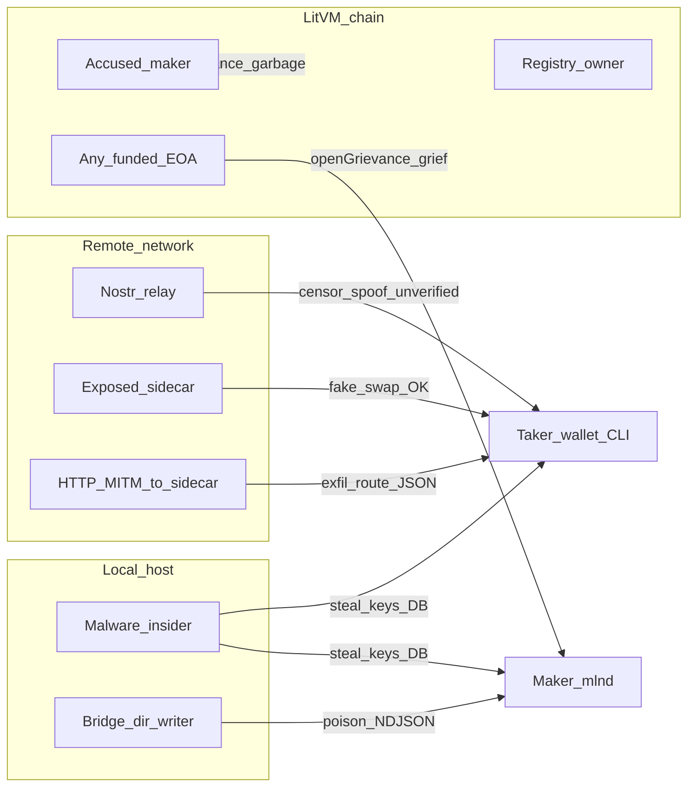

# Red team analysis — MLN stack (mwixnet-litvm)

**Date:** April 2026  
**Status:** Adversarial exercise narrative extending the accepted baseline in [`THREAT_MODEL_MLN.md`](THREAT_MODEL_MLN.md). Not a separate formal audit.

**Related:** [`PRODUCT_SPEC.md`](../PRODUCT_SPEC.md) (sections 5–6, 8), [`PHASE_15_ECONOMIC_HARDENING.md`](../PHASE_15_ECONOMIC_HARDENING.md), [`AGENTS.md`](../AGENTS.md).

---

## Executive summary

The repository is a **pre-production research and integration scaffold** across four layers: **MWEB** (delegated to `coinswapd` / fork in [`coinswapd/`](coinswapd/)), **LitVM** ([`contracts/`](../contracts/) — registry, grievance court, evidence hashing), **Nostr** (discovery — [`NOSTR_MLN.md`](NOSTR_MLN.md)), and **Tor** (advertised transport; limited runtime validation in reviewed code per [`THREAT_MODEL_MLN.md`](THREAT_MODEL_MLN.md)).

**Red-team bottom line:** The **strongest honest controls** are off-chain consistency checks in **`mlnd`** (receipt / `evidenceHash` / `grievanceId` alignment with chain events before building `defenseData`) and **Scout** (Schnorr + registry `eth_call` for “verified” makers). The **largest trust and abuse gaps** are (1) **on-chain court does not verify `defenseData`** — any accused can reach `Defended` with arbitrary bytes ([`GrievanceCourt.sol`](../contracts/src/GrievanceCourt.sol) still silences `defenseData` as “verifier TBD”), (2) **operator and wallet secrets in plaintext** on disk/env, (3) **`mln-sidecar` binds all interfaces by default** with **no auth**, and (4) **Forger → sidecar HTTP** without TLS pinning (CLI path weaker than desktop loopback warning).

**Phase 15 nuance (economics vs defense):** [`PHASE_15_ECONOMIC_HARDENING.md`](../PHASE_15_ECONOMIC_HARDENING.md) added **real slashing**, **accuser bond forfeit on exoneration**, and **post-resolution exit locks**. That **does not** fix the **bogus-defense** class of attacks: resolution logic can still depend on phases reached without cryptographic proof on-chain. The **Critical** residual for **unverified `defenseData`** in the primary threat table remains accurate.

---

## Scope and methodology

| In scope | Out of scope / shallow |
|----------|-------------------------|
| `contracts/src` (registry, court, `EvidenceLib`) | Full formal verification of MWEB / MWixnet math |
| `mlnd/` watcher, bridge, defender, SQLite | Upstream `ltcd` / full `coinswapd` audit |
| `mln-cli/` pathfind, scout, forger, config, Wails `desktop/` | Python CLIs beyond CI |
| `mln-sidecar/` HTTP API | End-user LitVM bridge implementation bugs |
| CI workflows (coverage gaps) | Third-party relay / Tor network global threats |

**Method:** Treat [`THREAT_MODEL_MLN.md`](THREAT_MODEL_MLN.md) as the **baseline audit**; this document maps tactics (MITRE-style loosely) to **components**, then stresses **cross-layer** scenarios (Nostr lies vs registry truth, local host compromise, griefing economics).

---

## Adversary models (who attacks what)

---

## Attack narratives (by feature / layer)

### 1. LitVM: grievance and stake lifecycle

| Tactic | Scenario | Impact | Notes |
|--------|----------|--------|--------|
| **State machine abuse** | Accused calls `defendGrievance` with empty `defenseData`; later resolution paths assume “defended” fairly | Undermines **cryptographic accountability** promised in [`PRODUCT_SPEC.md`](../PRODUCT_SPEC.md) principles; outcomes may not match real receipt validity | **P0** until verifier or explicit non-production scope |
| **Griefing** | Accuser opens grievances with **wrong** `evidenceHash` (on-chain does not verify preimage vs MWEB reality) | Stake **freeze**, operational pain; mitigated by **bond** and Phase 15 **exoneration bond to accused** | Residual **medium** — economic deterrent improved, DoS not eliminated |
| **Privileged ops** | Compromise **registry `owner`** (if upgradeable params added later) | Policy / governance failure | Currently **immutable** deploy assumptions — still **high** if owner key leaks |

### 2. `mlnd` (maker daemon)

| Tactic | Scenario | Impact | Notes |
|--------|----------|--------|--------|
| **Dual identity exfil** | Single process holds **`MLND_OPERATOR_PRIVATE_KEY`** and **`MLND_NOSTR_NSEC`** | Full maker **LitVM** + **reputation** capability to attacker | [`THREAT_MODEL_MLN.md`](THREAT_MODEL_MLN.md) §1.5 |
| **Bridge directory write** | Any principal that can write **`MLND_BRIDGE_RECEIPTS_DIR`** injects NDJSON | Receipt store pollution; **mitigated** by `ValidateReceiptForGrievance` vs on-chain event before defend | Filesystem permissions = real control |
| **Operational intel** | DRY-RUN logs **full `defenseData` hex** | Metadata leakage to log aggregators | Harden logging in production configs |

### 3. Taker path: `mln-cli`, desktop, Forger → sidecar

| Tactic | Scenario | Impact | Notes |
|--------|----------|--------|--------|
| **Cleartext RPC** | User points Forger at **remote HTTP** sidecar (CLI has **no** desktop `warnNonLoopback` parity) | **MITM**: fake success, **exfil** of route JSON (destination, amount) | **High** for remote HTTP |
| **Malware on wallet host** | Read **`OperatorEthPrivateKeyHex`** from `settings.json` | Impersonation, **Phase 14 self-route** abuse surface | **High** — plaintext key |
| **Pathfind randomness** | `math/rand` time-seeded — **acceptable** for tie-break only | Only becomes critical if policy ever ties **secrets** to path choice | Documented as intentional PoC |

### 4. `mln-sidecar`

| Tactic | Scenario | Impact | Notes |
|--------|----------|--------|--------|
| **Binding `0.0.0.0`** | Port reachable on LAN/WAN | Unauthenticated **POST /v1/swap**, **GET /v1/balance** | **P0** deployment hygiene: loopback default or explicit flag |
| **Mock mode confusion** | Operators run **`-mode=mock`** in a “real” environment | Users believe mixes executed when mocked | Operator process / doc discipline |

### 5. Nostr discovery

| Tactic | Scenario | Impact | Notes |
|--------|----------|--------|--------|
| **Relay censorship / eclipse** | Relays drop 31250/31251 | Poor routes, stuck UX | Inherent; multi-relay |
| **Unverified ads** | Fake ads **without** registry binding | Scout filters if user stays on verified path | **Lower** for strict Scout policy |
| **Sybil** | Many **min-stake** makers | Cheap surveillance / bad route graph | **Economic**, not purely technical |

### 6. MWEB / `coinswapd` fork

| Tactic | Scenario | Impact | Notes |
|--------|----------|--------|--------|
| **Fork supply chain** | Malicious or buggy **`mweb_submitRoute`** / balance RPC | Wrong onions, privacy breaks, failed grievance correlators | Out-of-repo deep dive; [`COINSWAPD_MLN_FORK_SPEC.md`](COINSWAPD_MLN_FORK_SPEC.md) |
| **Logging and metadata** | Node logs link sessions | Privacy failure vs product goals | Operator hardening |

---

## Cross-feature kill chains (examples)

1. **“Fake happy path” (taker)**  
   Expose sidecar OR MITM HTTP → Forger receives **mock OK** → user believes route submitted → **no on-chain grievance evidence** matches reality if they never hit real `coinswapd`.

2. **“Freeze then defend garbage” (maker vs court)**  
   Grievance opens (possibly griefing) → accused **`defendGrievance`** with junk → **chain accepts** → resolution proceeds under rules that assumed a real defense payload — **integrity gap** until verifier exists.

3. **“Host owns everything” (local)**  
   Malware reads wallet key + `mlnd` env → **LitVM** txs + **Nostr** posts + SQLite / bridge — **total operational compromise** (matches compact adversary table in [`THREAT_MODEL_MLN.md`](THREAT_MODEL_MLN.md) §2.2).

---

## Prioritized recommendations (red-team view)

Aligns with [`THREAT_MODEL_MLN.md`](THREAT_MODEL_MLN.md) §1.9, **reordered for exploitability**:

1. **P0 — Court:** Implement **on-chain `defenseData` verification** (or **disable** production claims and enforce **off-chain-only** dispute resolution explicitly in user-facing docs).
2. **P0 — Deploy:** Sidecar **127.0.0.1 default**, firewall docs, optional **auth** or Unix socket for local `coinswapd` coupling.
3. **P1 — Clients:** OS **keychain** / encrypted wallet storage; **TLS + pinning** (or Unix socket) for non-local Forger targets; extend **CLI** parity with desktop loopback/Tor warnings where applicable.
4. **P1 — CI:** Add **`make test-operator-smoke`** (and consider **Wails** build) per accepted gaps in the baseline threat model.
5. **P2 — Living sync:** On major contract changes, re-run **Slither + Foundry invariants** and append a **“delta”** subsection here or in document history below.

---

## Tabletop exercise template (60–90 minutes)

**Objective:** Walk a plausible attack end-to-end without code changes; capture gaps for backlog.

| Role | Responsibility |
|------|------------------|
| **Facilitator** | Keeps time, reads scenarios, records findings |
| **Red (network)** | Plays relay censorship, exposed sidecar, HTTP MITM |
| **Red (chain)** | Plays griefing accuser, accused with bogus `defenseData`, owner-key loss (what-if) |
| **Red (local)** | Plays malware with host access |
| **Blue (operator)** | Maker: `mlnd`, bridge dir permissions, env key hygiene |
| **Blue (taker)** | Wallet / CLI: Scout policy, Forger URL, sidecar trust |

**Scenarios (pick two):**

1. Taker uses **non-loopback HTTP** to sidecar on a laptop on café Wi‑Fi — what breaks first?
2. Accused maker **defends with garbage** after a **false grievance** — what do economics do (bond, slash) vs what *should* happen if receipts were verified on-chain?
3. **Bridge directory** is world-writable by mistake — can Blue still defend honestly?

**Outputs:** One page: top 3 controls that held, top 3 failures, owners, and whether each maps to P0/P1 in the list above.

---

## Document history

| Date | Note |
|------|------|
| 2026-04 | Initial red-team narrative + tabletop template; extends [`THREAT_MODEL_MLN.md`](THREAT_MODEL_MLN.md). |
