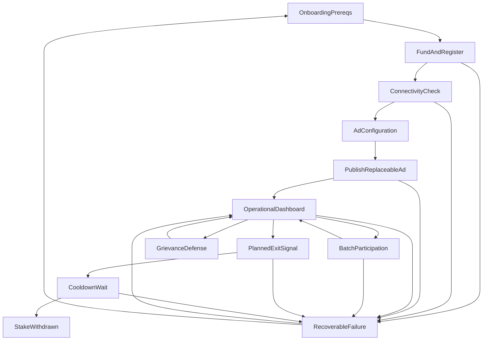

# Wallet / Operator Maker Flow v1 (Wireframe + Edge Cases)

Status: draft implementation spec for maker-operator tooling (desktop daemon UI, “node wallet,” or ops console).  
Scope: one maker lifecycle from first-time setup through normal operation, timelocked exit, and grievance awareness, aligned to existing MLN specs and contracts.

**Shipped operator UI (v1):** With `MLND_DASHBOARD_ADDR` set, `mlnd` serves a **loopback Maker control center** (LitVM / Nostr / MWEB pillars, read-only for chain writes). Setup: [`../mlnd/MAKER_DASHBOARD_SETUP.md`](../mlnd/MAKER_DASHBOARD_SETUP.md).

## Purpose

Define operator-facing UX that:

- Keeps **happy-path mix execution** on **MWEB** (`coinswapd`-style server role over **Tor**).
- Uses **LitVM** for **stake**, **identity binding** (`nostrKeyHash`), **exit queue**, and **grievance** interaction (freeze, defense window) — not for per-hop fee settlement in v1.
- Uses **Nostr** only to publish a **replaceable maker ad** and optional gossip; stake truth remains on LitVM.

This document is UI- and behavior-focused. It does not define new protocol rules.

**Wire note:** Replaceable maker advertisements are specified in [`research/NOSTR_MLN.md`](NOSTR_MLN.md) (`mln_maker_ad`, kind **31250**). [`research/NOSTR_EVENTS.md`](NOSTR_EVENTS.md) is an archived filename pointing at the same normative spec.

## Inputs and Defaults

- Epoch schedule (for operator planning): same v1 default as taker doc — daily cutover at **`00:00:00 UTC`** (see [`research/WALLET_TAKER_FLOW_V1.md`](WALLET_TAKER_FLOW_V1.md)).
- Operator must provide or generate: **LitVM-funded address**, **Nostr keypair** (for ads; must match on-chain `nostrKeyHash`), **Tor v3 service** for mix API (recommended), **fee hints** (optional, non-binding on Nostr).
- Node process: assume a **long-running** mix server alongside the wallet/daemon UI (exact binary is out of scope here; see [`research/COINSWAPD_TEARDOWN.md`](COINSWAPD_TEARDOWN.md)).

## End-to-End State Sequence

## State Definitions (Wireframe-Level)

### 1) Onboarding / Prerequisites

Purpose:
- Confirm operator understands layer split (MWEB vs LitVM vs Nostr vs Tor) and non-custodial failure modes.

UI elements:
- Short checklist: LitVM RPCURL, funded operator key, Nostr key, Tor (recommended).
- Links to [`research/USER_STORIES_MLN.md`](USER_STORIES_MLN.md) and [`PRODUCT_SPEC.md`](../PRODUCT_SPEC.md) section 5.

Validation:
- None blocking; informational.

Transitions:
- Continue → `Fund and Register`.

Backend assumptions:
- No chain writes yet.

### 2) Fund and Register (LitVM)

Purpose:
- Deposit stake and call **`registerMaker(nostrKeyHash)`** (or equivalent deployment flow) so wallets can bind ads to registry state.

UI elements:
- Current balance, minimum stake hint (deployment-specific).
- Fields: `nostrKeyHash` preview (derived from Nostr pubkey per [`NOSTR_MLN.md`](NOSTR_MLN.md)).
- CTAs: `Deposit`, `Register maker`, `Refresh status`.

Validation:
- Sufficient balance for stake + gas.
- `nostrKeyHash` matches chosen Nostr identity before registration is submitted.

Transitions:
- Registration confirmed on-chain → `Connectivity Check`.
- RPC/tx failure → `Recoverable Failure`.

Backend assumptions:
- [`contracts/src/MwixnetRegistry.sol`](../contracts/src/MwixnetRegistry.sol) is source of truth for stake and binding.

### 3) Connectivity Check

Purpose:
- Verify **Tor** reachability and LitVM RPC before advertising.

UI elements:
- Mix API listen address / onion (from local config).
- Optional: outbound ping to LitVM, relay reachability test.

Validation:
- Tor service up if user enabled “require Tor.”

Transitions:
- Pass → `Ad Configuration`.
- Fail → `Recoverable Failure` with fix instructions.

Backend assumptions:
- Mix API transport matches [`PRODUCT_SPEC.md`](../PRODUCT_SPEC.md) (Tor for client/node IP hiding).

### 4) Ad Configuration

Purpose:
- Prepare **`content` JSON** and tags for **`mln_maker_ad`** per [`NOSTR_MLN.md`](NOSTR_MLN.md) (`d` tag, `litvm` pointers, optional `fees`, `tor`, `capabilities`).

UI elements:
- Registry / `GrievanceCourt` addresses (must match deployment).
- Tor onion string, fee hint fields, capabilities tags.
- `d` tag preview: `mln:v1:<chainId>:<makerAddress>`.

Validation:
- JSON schema / required fields before publish.
- Chain id and contract addresses consistent with connected LitVM.

Transitions:
- Save draft locally → `Publish Replaceable Ad`.
- User can return from dashboard to edit.

Backend assumptions:
- Ads are **non-authoritative** for stake; they mirror intent.

### 5) Publish / Replace Ad (Nostr)

Purpose:
- Sign and submit replaceable **kind 31250** event; surface relay ack/errors.

UI elements:
- Relay list, publish status per relay, last `created_at`.
- CTA: `Publish`, `Replace ad`.

Validation:
- Event pubkey matches registered `nostrKeyHash` derivation.
- Signature valid.

Transitions:
- At least one relay accepted → `Operational Dashboard`.
- Total publish failure → `Recoverable Failure`.

Backend assumptions:
- NIP-33 replaceable semantics; stale relays may lag — operator sees “last published” timestamp.

### 6) Operational Dashboard

Purpose:
- Single home for **stake**, **exit state**, **epoch countdown (UTC)**, **ad health**, and **grievance** counters.

UI elements:
- Stake locked, registered maker address.
- **`openGrievanceCountAgainst`** (or equivalent) — **blocked exit** when non-zero per user stories.
- Exit state: `Active` / `Exit requested` / `Cooldown` / `Withdraw ready`.
- Countdown: next UTC epoch boundary (align with taker doc).
- Buttons: `Edit ad`, `Run mix server` (launch/monitor), `Request exit`, `Withdraw` (when eligible).

Validation:
- Poll LitVM on interval; debounce noisy errors.

Transitions:
- Operator starts batch window → `Batch Participation`.
- Operator chooses exit → `Planned Exit`.
- New grievance → `Grievance Defense` (can be modal interrupt).
- Critical fault → `Recoverable Failure`.

Backend assumptions:
- [`contracts/src/GrievanceCourt.sol`](../contracts/src/GrievanceCourt.sol) exposes grievance counts affecting registry exit gating (see [`PRODUCT_SPEC.md`](../PRODUCT_SPEC.md) section 5.1.1).

### 7) Batch Participation (In Epoch)

Purpose:
- Represent **server uptime** during a scheduled round — peel/forward/`finalize` work is MWEB-side; UI shows health, not full protocol internals.

UI elements:
- Status: `Waiting for batch`, `Processing`, `Idle`.
- Non-custodial reminder for operators: user funds are not held in contract escrow for the happy path.
- Log tail or RPC health (implementation-defined).

Validation:
- If local epoch id is used for logging, it must match the deployment-wide convention ([`research/USER_STORIES_MLN.md`](USER_STORIES_MLN.md) epoch semantics).

Transitions:
- Round ends cleanly → `Operational Dashboard`.
- Liveness/timeout errors → `Recoverable Failure` (retry / ops doc).

Backend assumptions:
- [`PRODUCT_SPEC.md`](../PRODUCT_SPEC.md) appendix 14 for MWEB tx layer; teardown for RPC names.

### 8) Planned Exit Signal

Purpose:
- Coordinate **off-chain “stop routing”** with **on-chain exit intent** per [`research/USER_STORIES_MLN.md`](USER_STORIES_MLN.md) (stop publishing `mln_maker_ad`; call **`requestWithdrawal`**).

UI elements:
- Warning: cooldown must exceed max epoch + **`T_challenge`** (product constraint; values deployment-specific).
- Ordered checklist:
  1. `Replace or delete ad` (operator stops new taker routes).
  2. `Call requestWithdrawal` on registry.
- Show blockers: open grievances, frozen stake.

Validation:
- **`openGrievanceCountAgainst == 0`** (and no freeze) before submitting `requestWithdrawal` if contract enforces it.

Transitions:
- Tx confirmed → `Cooldown Wait`.
- Blocked → stay with explanation.

Backend assumptions:
- [`PRODUCT_SPEC.md`](../PRODUCT_SPEC.md) section 5.1.1 unstaking lifecycle.

### 9) Cooldown Wait

Purpose:
- Show **time-to-unlock** and **blockers** (new grievance during cooldown freezes progress).

UI elements:
- Unlock ETA (from chain timestamp + `cooldownPeriod`).
- Grievance alert banner if count becomes non-zero.

Validation:
- Poll court/registry.

Transitions:
- `block.timestamp >= unlock` and no freeze → enable `withdrawStake` CTA.
- New open grievance → explain pause until resolution.

Backend assumptions:
- Exact freeze semantics follow `GrievanceCourt` + registry wiring in repo.

### 10) Stake Withdrawn

Purpose:
- Confirm **clean exit** or post-slash remainder (production economics may vary; scaffold may be full balance).

UI elements:
- Final tx link, cleared registration state.

Transitions:
- Return to `Onboarding` if operator wants another identity/chain.

### 11) Grievance Defense (Interrupt)

Purpose:
- Surface **open case**, **deadline**, and **defend** action — without teaching full evidence law in the default UI.

UI elements:
- `Grievance id`, `epoch id`, `evidenceHash` (read-only hex).
- Countdown for **`T_challenge`**.
- CTA: `Prepare defense` / `Submit defense` (calls `defendGrievance` with `defenseData` per deployment).
- Link to [`research/EVIDENCE_GENERATOR.md`](EVIDENCE_GENERATOR.md) for correlators.

Validation:
- Accused address matches logged-in operator.

Transitions:
- Resolved → return to `Operational Dashboard` with outcome summary (`resolveGrievance` outcome per spec).

Backend assumptions:
- [`PRODUCT_SPEC.md`](../PRODUCT_SPEC.md) section 6.5 judicial state machine.

### 12) Recoverable Failure + Retry

Purpose:
- Deterministic recovery for RPC, relay, Tor, and tx failures.

UI elements:
- Error class + recommended action (`Retry`, `Check Tor`, `Check relay`, `Increase gas`, `Contact ops`).
- `Export debug bundle` for support (no raw MWEB secrets by default policy).

Transitions:
- Retry appropriate step or return to `Operational Dashboard`.

## UTC-Midnight Epoch Semantics (Operator View)

Operators should see the **same** epoch boundary as takers for scheduling ads and expectations:

1. Anchor: **UTC**.
2. Cutover: **`00:00:00 UTC`** for v1 default (matches [`WALLET_TAKER_FLOW_V1.md`](WALLET_TAKER_FLOW_V1.md)).
3. Encourage **ad updates before cutover** if fees or Tor endpoint change, so takers do not assemble routes from stale hints.
4. **`epochId`** used in logs and any grievance-related UI must match the **deployment-wide** convention ([`research/USER_STORIES_MLN.md`](USER_STORIES_MLN.md)).

## Edge-Case Matrix (Operator Message + Tooling Action)

| Case | Detection point | Operator-facing message | Action |
| --- | --- | --- | --- |
| Insufficient stake for registration | Fund/register | `Not enough balance to register with the required stake.` | Deposit more or lower stake if policy allows; retry. |
| `nostrKeyHash` mismatch | Publish ad | `This Nostr key does not match the registry binding.` | Switch Nostr key or re-register (if deployment allows). |
| All relays reject ad | Publish | `Could not reach any Nostr relay.` | Check network, relay URLs, credentials; retries with backoff. |
| LitVM RPC unavailable | Dashboard poll | `Cannot read registry state.` | Fall back to cached last-known; show stale banner; manual RPC fix. |
| Tor not running | Connectivity | `Tor service is down; clients may not reach your mix API.` | Start Tor; do not claim “live” until confirmed. |
| `requestWithdrawal` reverts (open grievance) | Planned exit | `Exit blocked: open grievance(s) against this maker.` | Show count; link to defense flow; wait for resolution. |
| Stake frozen mid-cooldown | Cooldown | `Withdrawal paused: stake frozen for an open case.` | Same as above; show court phase if available. |
| Cooldown incomplete | Withdraw | `Cooldown not finished yet.` | Show unlock time; disable withdraw until eligible. |
| Wrong contract addresses in ad | Ad config | `Ad pointers do not match connected LitVM deployment.` | Fix litvm object and re-publish before claiming live. |
| Batch server crash mid-epoch | Batch participation | `Mix server stopped unexpectedly.` | Restart server; follow ops runbook; preserve logs for disputes. |

## Mapping to Existing Specs

- Maker role and responsibilities: [`PRODUCT_SPEC.md`](../PRODUCT_SPEC.md) section 4; [`research/USER_STORIES_MLN.md`](USER_STORIES_MLN.md) personas and story 4.
- Timelocked unstaking: [`PRODUCT_SPEC.md`](../PRODUCT_SPEC.md) section 5.1.1; [`research/USER_STORIES_MLN.md`](USER_STORIES_MLN.md) “Maker exit.”
- Nostr maker ad wire: [`research/NOSTR_MLN.md`](NOSTR_MLN.md) (`mln_maker_ad`, `nostrKeyHash`).
- Grievance lifecycle (defense, freeze): [`PRODUCT_SPEC.md`](../PRODUCT_SPEC.md) sections 6–6.5; [`research/NOSTR_MLN.md`](NOSTR_MLN.md) grievance pointer (`mln_grievance_pointer`, kind **31251**; gossip only).
- Evidence correlators (if accused): [`research/EVIDENCE_GENERATOR.md`](EVIDENCE_GENERATOR.md); [`contracts/src/EvidenceLib.sol`](../contracts/src/EvidenceLib.sol).
- Taker-facing counterpart flow: [`research/WALLET_TAKER_FLOW_V1.md`](WALLET_TAKER_FLOW_V1.md).

## Acceptance Checklist

- [x] Flow covers setup, advertise, operate, exit, and grievance awareness.
- [x] UTC-midnight scheduling is consistent with the taker v1 doc.
- [x] Edge cases include operator message and deterministic action.
- [x] No new protocol rail (MWEB fees happy path; LitVM judicial + registry only).
- [x] Traceable to current product spec, user stories, Nostr profile, and contracts.

## Implementation gap: today vs. target

This section is the **product and engineering blueprint** for closing operator friction. It is safe to treat as normative *for implementation planning*; it does not change protocol rules in [`PRODUCT_SPEC.md`](../PRODUCT_SPEC.md) or [`research/NOSTR_MLN.md`](NOSTR_MLN.md).

### Diagnosis: fragmentation, not math

The hard part for makers is not understanding stake or `nostrKeyHash` in the abstract—it is **orchestrating** LitVM transactions, Nostr signing, Tor / mix API, and a long-running daemon (`mlnd`) with many environment variables, **without** config drift or copy-paste errors. Today that work is split across terminals, READMEs, and optional tooling. That fragmentation is what filters out most would-be operators.

**Target:** one coherent operator journey (checklist or app) that preserves layer truth (MWEB vs LitVM vs Nostr) while hiding jargon on the default path.

### 1) Bundle signing (MVP feature)

The highest-leverage simplification is a **single flow** that:

- Loads the **operator LitVM key** (file, env, or later hardware wallet).
- Derives **`nostrKeyHash`** automatically from the chosen Nostr identity per [`NOSTR_MLN.md`](NOSTR_MLN.md) (`keccak256` over the 32-byte x-only pubkey)—no manual hashing in a separate tool.
- Submits **`MwixnetRegistry.deposit()`** (to meet `minStake`) and **`registerMaker(nostrKeyHash)`** in sequence with clear copy, gas/stake hints from chain, and recovery on failure.

That removes the dominant failure mode: **mismatch** between the EVM operator, the Nostr key used for ads, and the on-chain binding. Implementation can live first in **`mln-cli`** (see sequencing below) and later behind a desktop or loopback UI.

Contract reference: [`contracts/src/MwixnetRegistry.sol`](../contracts/src/MwixnetRegistry.sol).

### 2) Actionable next steps (not only red badges)

Status UI should reduce anxiety and drive **the next action**:

- **Bad:** a red badge that only says “Unregistered.”
- **Better:** copy such as “Not registered on this registry → **Register**” (or “Stake below minimum → **Deposit**”) with a path to the flow that fixes it.

The shipped loopback **Maker control center** ([`../mlnd/MAKER_DASHBOARD_SETUP.md`](../mlnd/MAKER_DASHBOARD_SETUP.md)) is read-only for chain writes today; **target** is to surface the same registry/Nostr/Tor signals **plus** explicit next steps and links (or in-process CTAs once bundle signing exists). Persistent **connection health** (short RPC label, relay/Tor hints) stays mandatory per [`research/USER_STORIES_MLN.md`](USER_STORIES_MLN.md).

### 3) Fee hints as one control

Maker **fee hints** on the ad are optional and non-binding on MWEB; they should appear in operator UX as a **single control** (e.g. min/max sat per hop), persisted to config or env, instead of expecting operators to discover `MLND_FEE_MIN_SAT` / `MLND_FEE_MAX_SAT` names from [`../mlnd/README.md`](../mlnd/README.md) alone.

### 4) Deployment presets

**Local Anvil** vs **LitVM testnet** (or future mainnet) wizards should preload chain id, registry, and court addresses from a deployment manifest where possible, and reuse the same validation rules as production clients (no zero address, no placeholder strings). That cuts shell paste errors (e.g. broken one-line `export` chains).

### Pragmatic sequencing (engineering roadmap)

Work can ship in layers without building the full Wails wizard on day one:

| Phase | Scope | Outcome |
| --- | --- | --- |
| **A** | Docs + dashboard copy | Ordered **checklist** in setup doc and/or UI: prerequisites → stake/register (external for now) → connectivity → ad env → operational view. Deep links to canonical paths. |
| **B** | **`mln-cli maker onboard`** (shipped) | RPC read `minStake` / stake / `makerNostrKeyHash` / `exitUnlockTime` / `stakeFrozen`; dry-run by default; `-execute` sends `deposit` (if needed) + `registerMaker` with `nostrKeyHash` from `MLN_NOSTR_PUBKEY_HEX` or `MLN_NOSTR_NSEC`. See [`PHASE_10_TAKER_CLI.md`](../PHASE_10_TAKER_CLI.md) (Phase 10.4). |
| **C** | Desktop or extended loopback UI | Wizard driving **B**, writes consistent **`mlnd`** config, embeds or opens the existing dashboard as **status**. |

Phase **B** is implemented as **`mln-cli maker onboard`**; Phase **A** checklist polish and Phase **C** UI can build on it.

### Layer boundaries (unchanged)

Simplifying UX must **not** blur accountability: **LitVM** remains authoritative for stake and grievances; **Nostr** for discovery; **MWEB** for mix execution and default routing fees. Operator copy should say so in **Advanced** or **Developer** sections, not on every screen.
