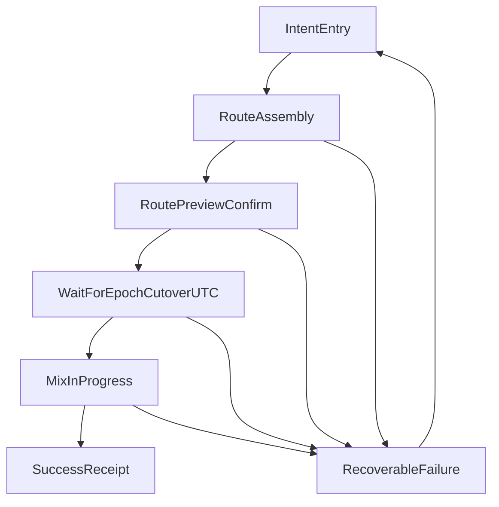

# Wallet Taker Flow v1 (Wireframe + Edge Cases)

Status: draft implementation spec for wallet teams.  
Scope: one taker flow for scheduled batched epochs, aligned to existing MLN architecture docs and contracts.

## Purpose

Define a wallet-ready taker UX that:

- Keeps happy-path mixing on MWEB.
- Uses LitVM only for maker stake authority and grievance lifecycle context.
- Uses Nostr for discovery/liveness signals.
- Uses UTC-midnight daily epochs as the v1 default schedule.

This document is intentionally UI- and behavior-focused. It does not define new protocol rules.

## Inputs and Defaults

- Epoch schedule: daily at `00:00:00 UTC`.
- User policy presets:
  - `Fast`: prioritize earliest eligible batch with relaxed diversity targets.
  - `Privacy`: prioritize larger eligible maker set, stricter diversity, and lower route reuse.
- Route policy defaults (from user stories):
  - Stake floor enabled.
  - Fee minimization under constraints.
  - Minimum hop count enabled.
  - Liveness filtering enabled.
  - Diversity checks enabled.

## End-to-End State Sequence

## State Definitions (Wireframe-Level)

### 1) Intent Entry

Purpose:
- Collect the minimum user inputs: amount and preset (`Fast` or `Privacy`).

UI elements:
- Amount field.
- Preset selector.
- Primary CTA: `Find route for next epoch`.

Validation:
- Amount must be above wallet/network minimums.
- Amount must leave expected fee headroom under selected preset.

Transitions:
- On valid submit: go to `Route Assembly`.
- On invalid input: show inline error and stay.

Backend assumptions:
- No on-chain writes.
- No onion build yet.

### 2) Route Assembly (Loading)

Purpose:
- Build an eligible ordered maker route using Nostr discovery and LitVM stake checks.

UI elements:
- Loading stepper:
  - `Discovering maker ads`
  - `Verifying stake and identity`
  - `Scoring routes`
- Cancel button (`Back` to edit intent).

Validation and filtering:
- Only include makers passing stake floor and identity binding checks.
- Drop stale or unreachable ad endpoints based on liveness policy.
- Reject routes violating min hops/diversity constraints.
- Reject candidate routes exceeding fee ceiling from user policy.

Transitions:
- At least one candidate route: go to `Route Preview/Confirm`.
- No viable route: go to `Recoverable Failure` with actionable reason.

Backend assumptions:
- Nostr is informational and high-churn.
- LitVM stake/identity is authoritative for eligibility.

### 3) Route Preview / Confirm

Purpose:
- Let user approve a wallet-generated route summary without manual hop picking.

UI elements:
- Summary card:
  - Eligible makers scanned.
  - Selected hops.
  - Estimated total MWEB routing fee.
  - Privacy level label (derived from preset + route quality).
  - Countdown to next UTC epoch cutover.
- Primary CTA: `Confirm and queue`.
- Secondary CTA: `Rebuild route`.

Validation:
- Re-check selected route freshness before confirm (ad freshness + stake floor still true).

Transitions:
- Confirm success: go to `Waiting for Epoch Cutover`.
- Freshness/stake drift failure: go to `Recoverable Failure`.
- Rebuild route: return to `Route Assembly`.

Backend assumptions:
- Wallet can build local intent/queue state for epoch `E`.
- No requirement to expose per-hop manual controls in default UX.

### 4) Waiting for Epoch Cutover (UTC)

Purpose:
- Hold queued intent until epoch boundary.

UI elements:
- `Next batch in HH:MM:SS (UTC)`.
- Target epoch id display (wallet-local derived value for UX/debug).
- Status note: `Queued locally; final route revalidation at cutover`.
- Optional action: `Cancel queue`.

Epoch rules:
- Boundary instant is exactly `00:00:00 UTC`.
- Submissions after cutover are assigned to next epoch by wallet/node policy.

Transitions:
- At cutover with successful revalidation: go to `Mix In Progress`.
- Cutover revalidation failure: go to `Recoverable Failure`.
- User cancel: return to `Intent Entry`.

Backend assumptions:
- Wallet and node must use the same epoch mapping convention for grievance correlators.

### 5) Mix In Progress

Purpose:
- Execute/simulate the batched mix flow and show progress with minimal cognitive load.

UI elements:
- Progress status:
  - `Constructing onion payload`
  - `Submitting to route`
  - `Awaiting batch completion`
- Non-custodial safety note: `If batch fails, funds remain unspent`.

Transitions:
- Completion success: go to `Success / Receipt`.
- Timeout/route failure/non-completion: go to `Recoverable Failure`.

Backend assumptions:
- Happy-path economics remain on MWEB.
- LitVM is only used if grievance path is later required.

### 6) Success / Receipt

Purpose:
- Provide completion outcome and key summary metadata.

UI elements:
- Confirmation status.
- Amount mixed.
- Effective fee summary.
- Epoch reference and timestamp (UTC).
- Optional technical details panel for advanced users.

Transitions:
- Done: return to home/start.
- New mix: return to `Intent Entry` with prior preset remembered.

Backend assumptions:
- Store local audit trail for user support and optional dispute context.

### 7) Recoverable Failure + Retry

Purpose:
- Provide deterministic next actions and preserve context for retry/dispute.

UI elements:
- Clear error reason.
- Recommended action (`Retry now`, `Wait next epoch`, `Rebuild route`, `Abort`).
- `Export debug bundle` (advanced): local metadata needed to reconstruct evidence context.

Transitions:
- Retry now: route assembly or cutover revalidation depending on failure stage.
- Wait next epoch: go to `Waiting for Epoch Cutover`.
- Abort: go to `Intent Entry`.

Backend assumptions:
- Preserve local correlators (epoch reference, selected route snapshot, hashes/log references) for potential grievance packaging workflows.

## UTC-Midnight Epoch Semantics (v1)

The wallet must implement these fixed rules:

1. Anchor: UTC clock only.
2. Cutover: strict instant `00:00:00 UTC`.
3. Countdown source: trusted UTC time source if available; otherwise local clock with drift warning.
4. Near-boundary behavior:
   - If user confirms within a configurable safety window before cutover, wallet warns that assignment may roll to `E+1`.
   - Wallet performs mandatory route revalidation at cutover.
5. Epoch id convention:
   - Use one deployed convention consistently across wallet, nodes, and grievance tooling.
   - Show this as read-only diagnostic metadata to avoid user confusion.

## Edge-Case Matrix (User Message + Wallet Action)

| Case | Detection point | User-facing message | Wallet action |
| --- | --- | --- | --- |
| No makers online | Route assembly | `No active makers found right now.` | Retry discovery with backoff; allow wait-until-next-epoch option. |
| Insufficient makers for min hops/diversity | Route assembly | `Not enough eligible makers for your privacy settings.` | Offer switch to `Fast` preset or wait next epoch. |
| Maker ad becomes stale before confirm | Route preview confirm | `Route changed before confirmation.` | Rebuild route automatically; require re-confirmation. |
| Stake drops below floor during assembly/confirm | Assembly or preview | `A selected maker no longer meets stake requirements.` | Remove maker, recompute route, re-present summary. |
| Estimated fees exceed policy ceiling | Assembly | `Current fees are above your selected limit.` | Offer wait, preset change, or manual advanced override if enabled. |
| Confirm submitted near epoch boundary | Preview -> waiting | `This request may be processed in the next epoch.` | Label as pending boundary decision; finalize assignment at cutover. |
| Clock drift suspected | Waiting | `Device time may be out of sync with UTC epoch timing.` | Show drift warning, prompt clock sync, continue with conservative cutover guard. |
| Route invalidated exactly at cutover | Waiting | `Route could not be validated for this batch.` | Move to retry path with option to target next epoch. |
| Mix timeout / no completion signal | In progress | `Batch did not complete in time. Funds remain unspent.` | Mark as failed, preserve local evidence context, offer retry/re-route. |
| Suspected maker fault requiring grievance prep | Recoverable failure | `You can prepare dispute evidence for review.` | Keep/export local correlators compatible with evidence hashing workflow. |

## Mapping to Existing Specs

State-to-spec alignment:

- Layer boundaries and role split:
  - `PRODUCT_SPEC.md` sections 3-4.
  - `research/USER_STORIES_MLN.md` canonical roles table.
- Taker auto-route and policy knobs:
  - `research/USER_STORIES_MLN.md` (Taker goals + Wallet PoC policy table).
- Nostr discovery semantics:
  - `research/NOSTR_EVENTS.md` (ads and pointers as informational layer).
- Epoch and `epochId` consistency:
  - `research/USER_STORIES_MLN.md` epoch semantics.
  - `PRODUCT_SPEC.md` section 7.1.
- Grievance correlator/evidence preparation assumptions:
  - `research/EVIDENCE_GENERATOR.md`.
  - `contracts/src/EvidenceLib.sol`.

## Acceptance Checklist

- [x] Flow includes all required states from intent to success/failure.
- [x] UTC-midnight behavior and boundary handling are explicit.
- [x] Edge cases include both user message and deterministic wallet action.
- [x] No new protocol rail introduced (MWEB fees remain happy path; LitVM judicial role only).
- [x] Every flow segment is traceable to current MLN spec/research sources.
